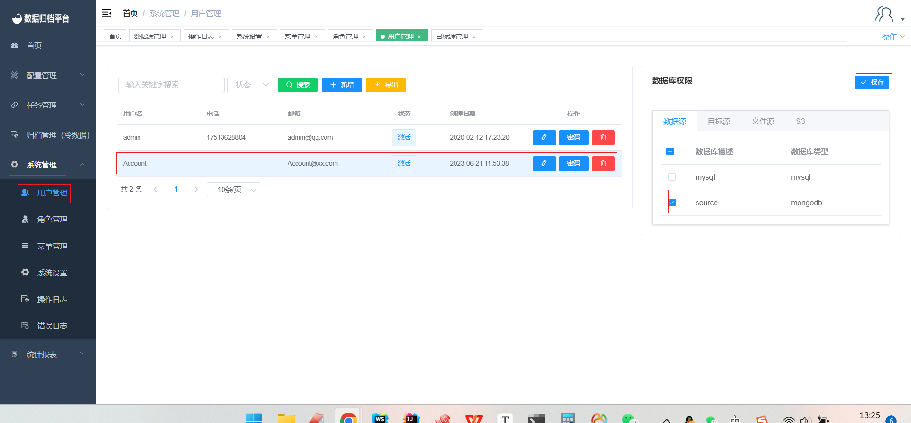

#### Adding a Data Source

To add a new data source to the platform, follow these steps:

1. Click on the "Configuration Management" menu and select "Data Source Management".
2. Click the blue "Add" button to open the form.
3. Fill in the basic information for the new data source and click "Test". If you see a "Test Passed" message above, click "Save" to successfully add the data source. If the test fails, double-check the provided information for accuracy.
4. After adding the data source, go to the "System Management" menu and select "User Management". Click on the user you want to bind the data source to.
5. In the user details, select the added data source from the list and click "Save". This user will now have access to the newly added data source.

By following these steps, you can easily add and configure new data sources, allowing users to access and utilize these sources for various operations within the Whaleal Data platform.