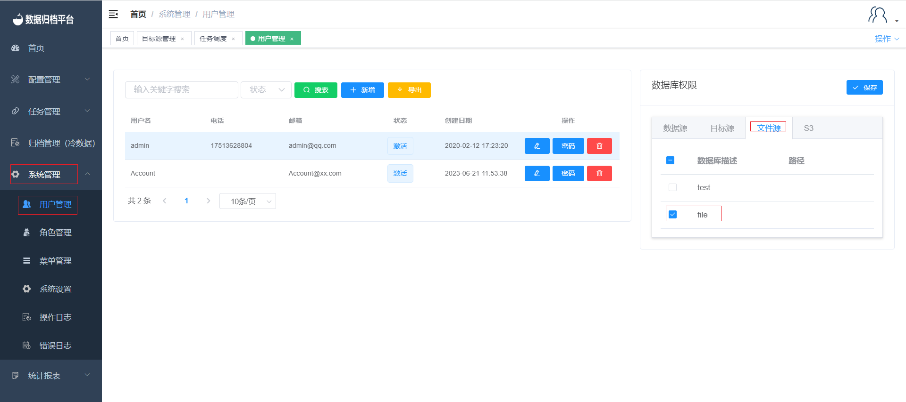
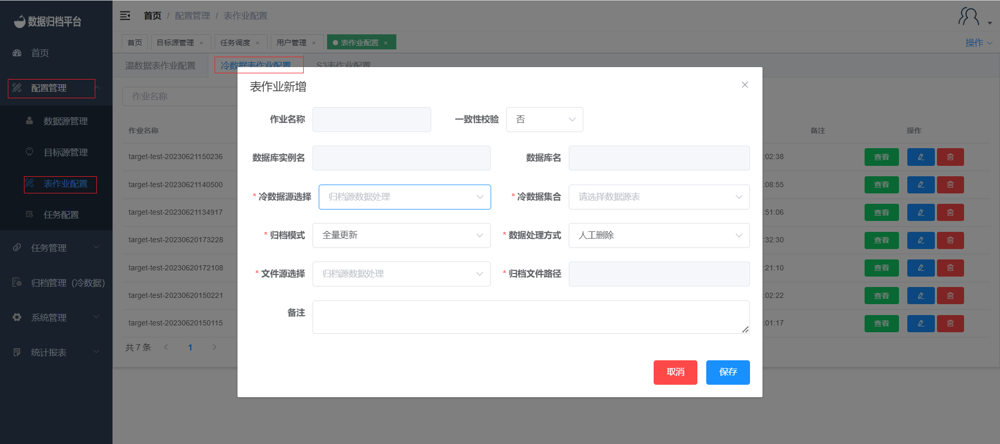
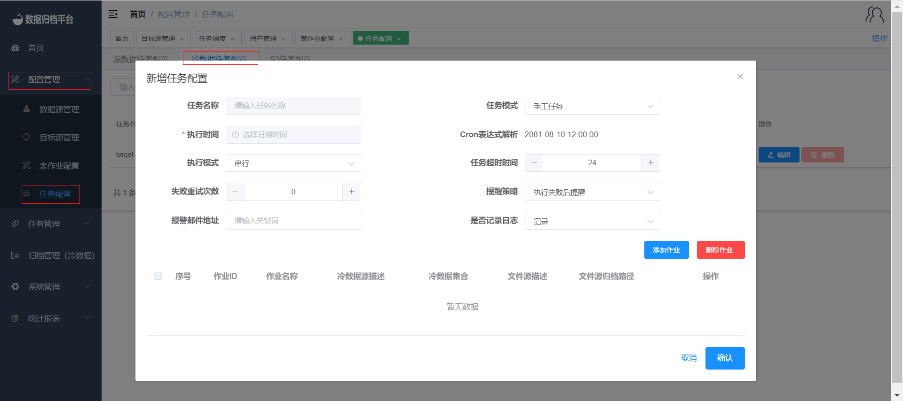
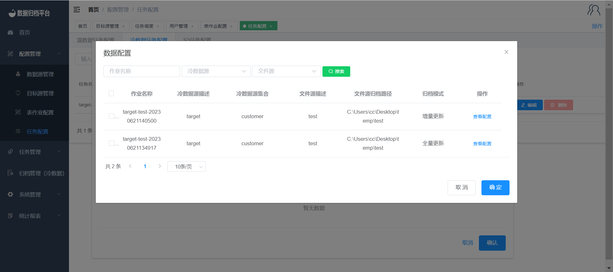
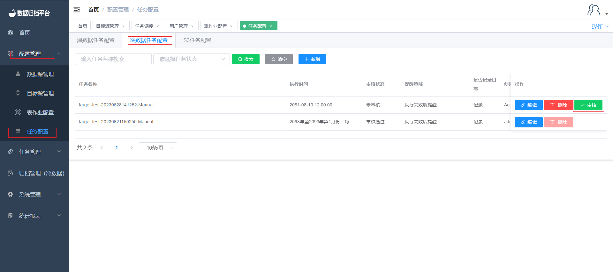
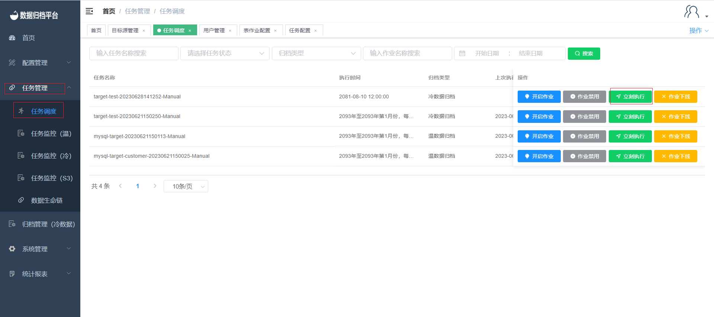
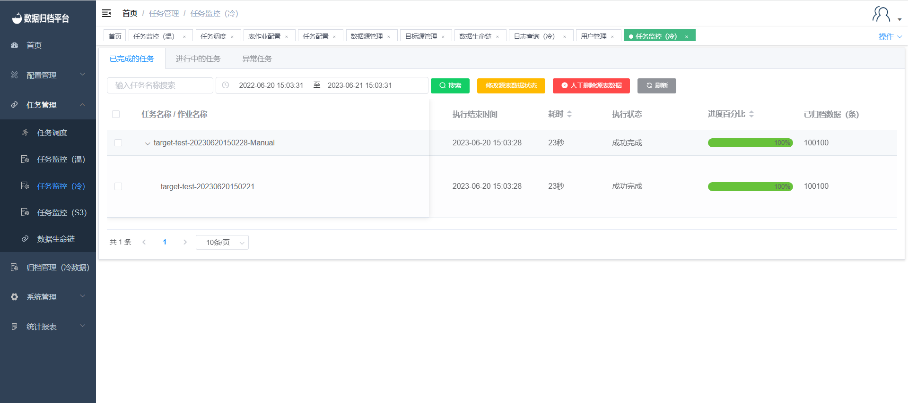

## Cold Job Demo

Here's a step-by-step demonstration of how to create and manage a cold data archiving job in the platform:

### 1. Add Data Source and File Source

#### Add Data Source
1. Go to the "Configuration Management" menu and select "Data Source Management".
2. Click the blue "Add" button and fill in the required information for the data source. Test the connection and save it if the test is successful.

#### Add File Source
1. Go to the "Configuration Management" menu and select "Target Source Management".
2. Click on "Cold Data File Source" and then click the blue "Add" button.
3. Fill in the necessary information related to cold data archiving and save the file source.

### 2. Assign Permissions

After adding the data source and file source, administrators need to assign database permissions in the "User Management" page under "System Management".

### 3. Create a Cold Job

1. Go to the "Configuration Management" menu and select "Table Job Configuration".
2. Click the blue "Add" button in the "Cold Data Table Job" section.
3. Fill in the required information, including selecting the data source and file source.
4. Optionally, configure data consistency validation and choose the data handling method after synchronization.
5. Save the job configuration.

### 4. Create a Task

1. Click on the "Task Configuration" menu and then "Cold Data Task Configuration".
2. Click the blue "Add" button to create a new task configuration.
3. Fill in the necessary details according to your requirements.
4. Optionally, configure execution mode, task timeout, retry attempts, and notification settings.
5. Choose the notification strategy and add email addresses for alerts.
6. Save the task configuration.

#### Add Table Jobs to the Task
1. Click "Add Job" to associate table jobs with the created task.
2. Select the desired table jobs and click "Confirm" to add them to the task.

#### Admin Approval
1. After configuring the task, an administrator can review and approve it if needed.
2. The task is ready for execution after approval.

### 5. Task Scheduling

1. Navigate to the "Task Management" menu and select "Task Scheduling".
2. Monitor the status of the task in this section.
3. Click "Execute Now" to immediately execute the task.

### 6. Task Monitoring

1. In the task scheduling section, you can monitor the execution status of the task.
2. Visit the "Task Monitoring (Cold)" page to view the detailed execution status of the task.

By following these steps, you can successfully create, configure, and manage cold data archiving jobs in the platform. This allows you to archive data from various sources and monitor the execution of tasks for data consistency and reliability.