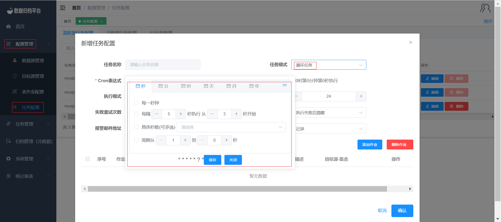

#### Creating Recurring Tasks

Creating a recurring task is similar to creating a one-time task. The key difference is that you need to set the execution interval for the recurring task, which determines when the task will be executed again in the future. Here's how you can create and manage recurring tasks:

1. Follow the same steps for creating a task configuration, just like you did for the one-time task.
2. In the task configuration, set the execution mode to "Recurring."
3. Specify the execution interval, which determines how often the task will be repeated.
4. Fill in the rest of the task configuration details and save the configuration.

After configuring the recurring task, an administrator needs to review and approve it, just like with one-time tasks. Once the recurring task is approved, you can find it in the "Task Scheduling" section.

To execute a recurring task:

1. Navigate to the "Task Management" menu and select "Task Scheduling."
2. Locate the recurring task you want to execute.
3. Click the "Execute Now" button next to the task. This will trigger the immediate execution of the task according to the predefined execution interval.

By creating recurring tasks, you can automate data archiving and synchronization at regular intervals, ensuring that your data remains up-to-date and consistent over time.

