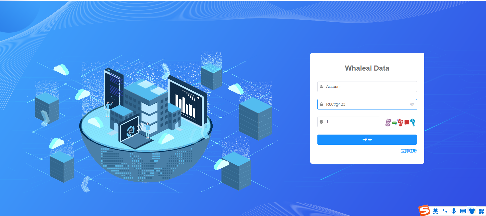

## User Login

To log in, enter the registered account credentials. For the first login of an administrator, the initial password is "123456." After logging in, you will be prompted to change the password. Other registered users have user-level permissions. Administrator users can assign permissions to new users.

