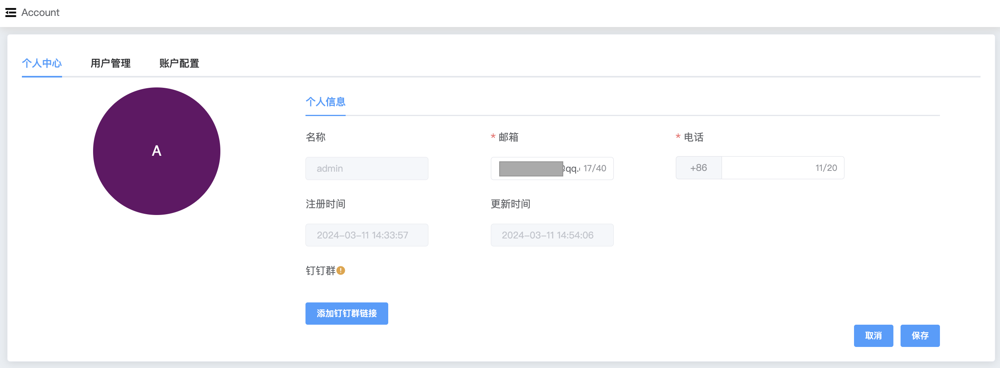

## Account Center

```
Account Center The following can be configured：
 - Email
 - Phone Number
 - Dingding URL
```

Personal center, you can modify personal information including email, phone number and other information

a. Enter the navigation bar on the left side of the page

b. Click the Account option button and select the Personal Center option

c. Click the Edit Profile option button to modify personal information



### Email

Modify the email address in personal information in the edit profile, and after configuring the alarm in Whaleal, the alarm notification will be sent to the personal mailbox simultaneously.


### Phone Number

After modifying the phone number in personal information in the edit profile and configuring the alarm in Whaleal, the alarm notification will be sent to the personal mobile phone synchronously in the form of text messages.

### Dingding URL

Robots can be added to the DingTalk group. After the addition is completed, the Webhook URL will be provided. The access_token value in the address will be configured to the Whaleal personal center page. Alarm notifications will be sent to the DingTalk group simultaneously.

