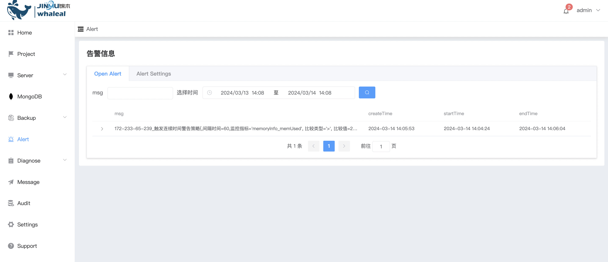
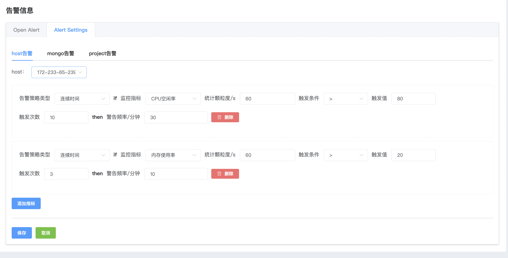
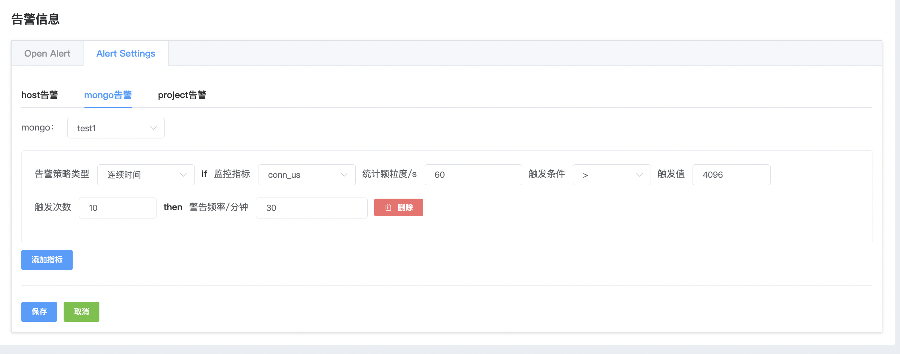
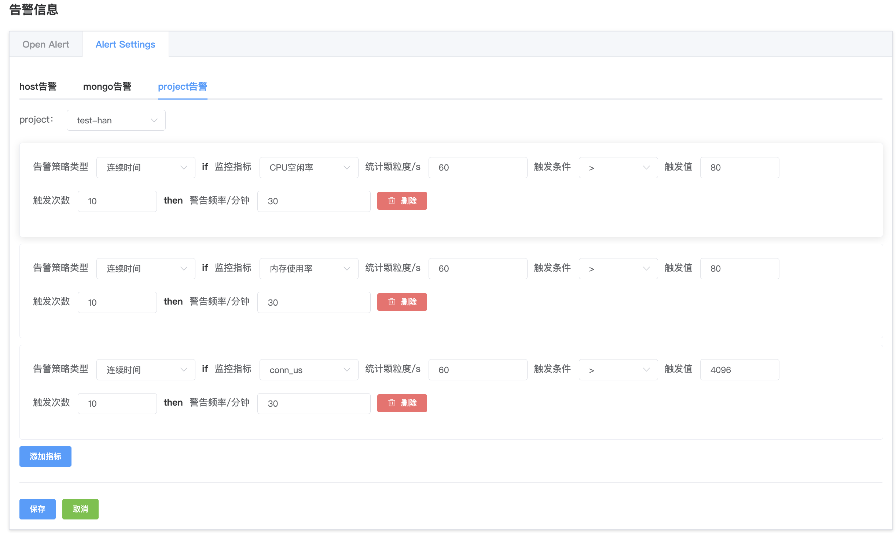

## Alert

**Alert**

Alert, host and MongoDB monitoring alarms are key measures to ensure stable operation of the system. By monitoring host resource utilization, service status, and monitoring the performance, status, space utilization, etc. of the MongoDB database, abnormal situations can be discovered in a timely manner and alarms can be triggered to help administrators take timely measures to ensure the normal operation of the system and database.

Alert message

a. Navigate to the left sidebar of the page

b. Click the Alert option button to display the current alert messages.

Alert configuration

a. Click on Alert Settings to configure alerts

b. Select the type of alert you want to configure

* Host alert, can configure monitoring alerts for host-level resource conditions

* Mongo alert, can configure performance monitoring alerts for MongoDB

* Project alert, configure alerts for all hosts and MongoDBs included in the project

c. Click Save after configuration is completed.