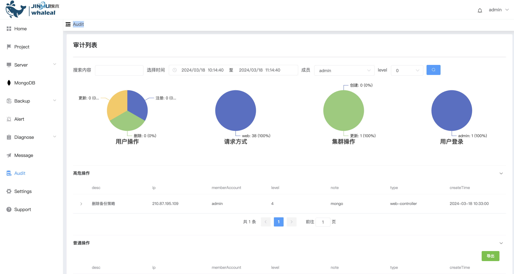
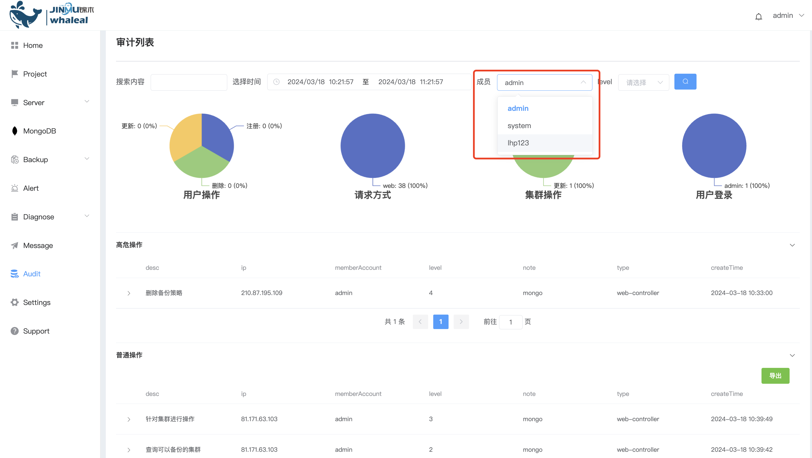
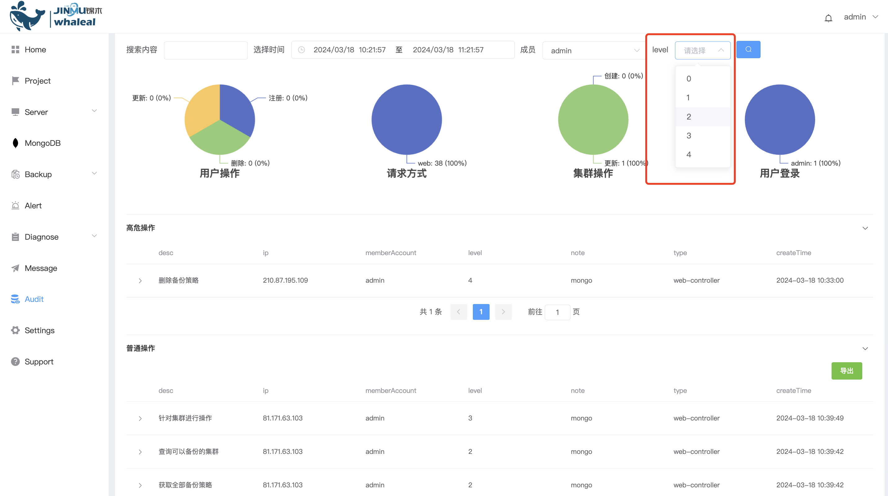

## Audit

**Audit List**

The platform list function records key information in detail, including important content such as user operations, request methods, cluster operations, and user logins. These records provide administrators with a comprehensive data view and timely discovery of any potential security risks or abnormal behaviors.

Filter by members

Select audit level

