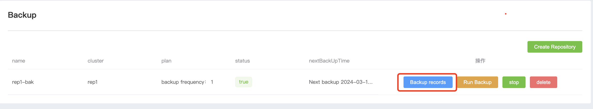
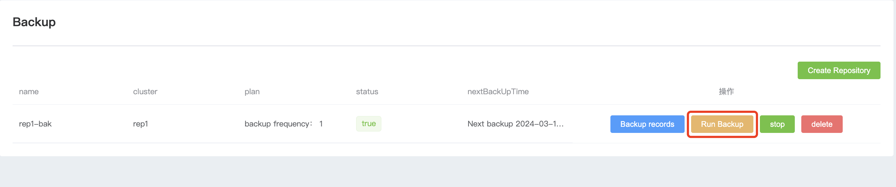
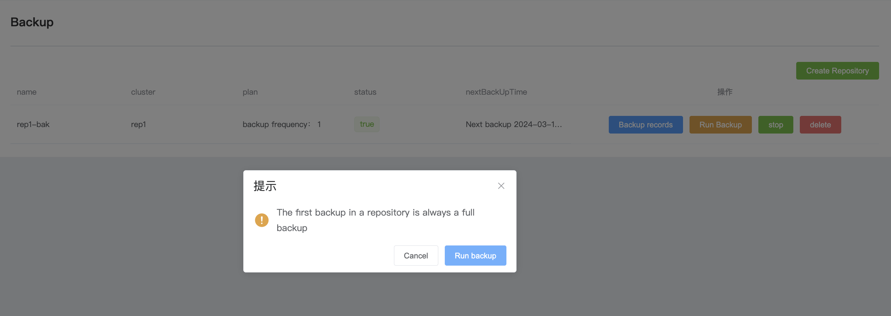
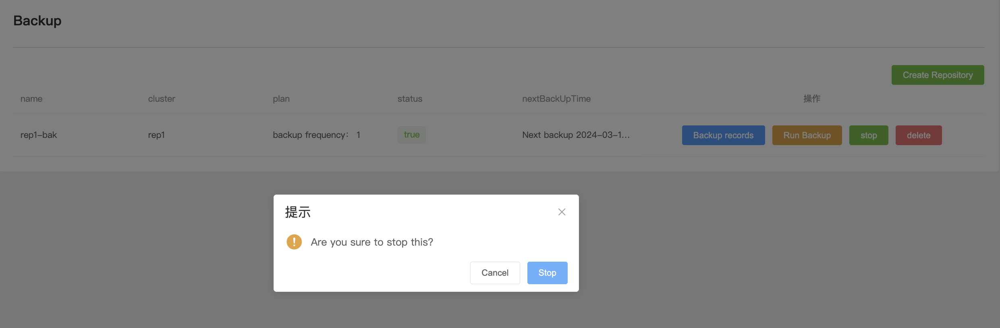
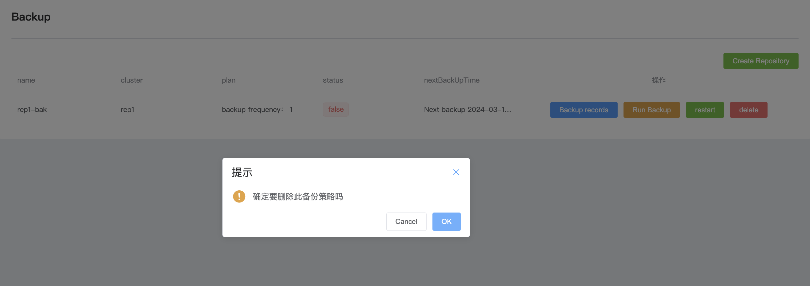

## Backup

**1. Enable backup**

WAP can store MongoDB data backup to Linode S3 and Amazon S3 to store and manage your data safely and reliably.

a. Enter the navigation bar on the left side of the page

b. Click the Backup option button to display all current backup strategies

c. Click Create Repository to create a backup

| Configuration items  | value                                         |
| -------------------- | --------------------------------------------- |
| Name                 | The name of the current backup                |
| cluster              | Select the mongodb cluster you want to backup |
| Storage Location     | Choose where you want to store your backups   |
| Cloud Bucket         | The s3 bucket name you store                  |
| Path Prefix          | The path defaults to wap                      |
| Access Key           | access key                                    |
| Secret Key           | key                                           |
| Endpoint             | The region name of the bucket                 |
| Task snapshots every | Task snapshot interval                        |
| Recover data from    | Number of days to keep backup data            |

d. After the configuration is completed, click Confirm to create the backup task

**2. Function introduction**

a. Backup records

* After clicking, you can see the records of each backup

* Click Event Log to see detailed log records of the backup

b.Enable backup

* Click Run Backup and a backup task will be run immediately.

c. Stop backup

* After clicking stop, this backup task will no longer be executed. If you need to start it, click start and the backup will be started again.

d.Delete backup

* After clicking Delete Backup, this backup policy will be completely deleted and will not exist in the backup.

