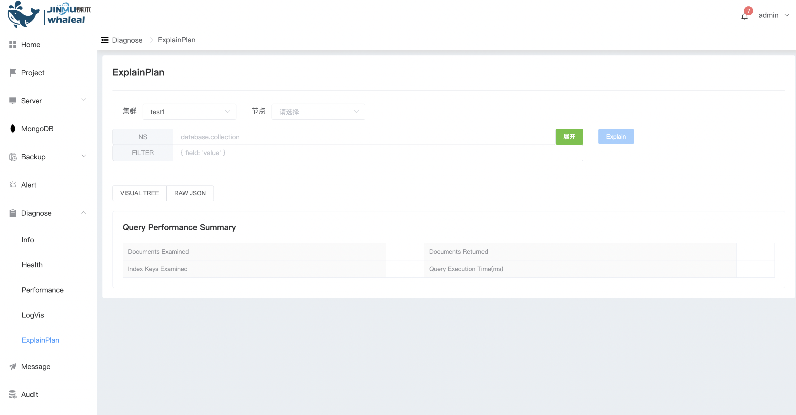
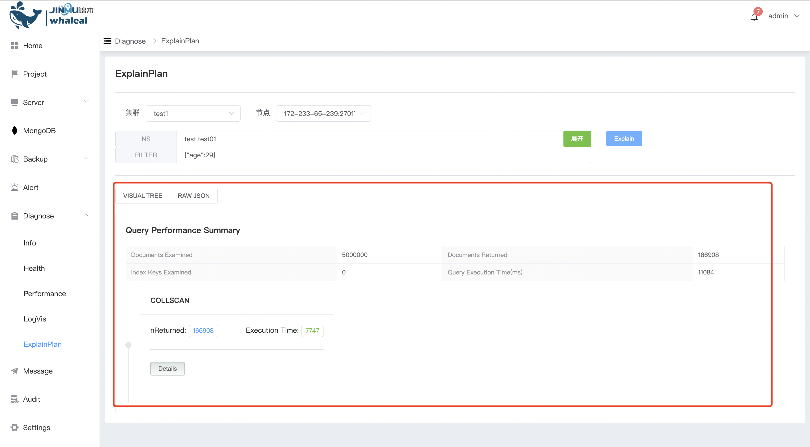

## ExplainPlan

**Implementation plan**

Explain Plan (execution plan) is used to explain the execution method and optimization strategy of query statements. By analyzing the execution plan, administrators can understand the execution of the query, discover potential performance bottlenecks, and optimize it. You can optimize query statements, create appropriate indexes, or adjust the storage structure of the collection based on the execution plan to improve query efficiency and overall performance.

Execute explain

a. Select the cluster and node, enter the database table, query the conditions and click Explain

b. You can view the results of the current explain

