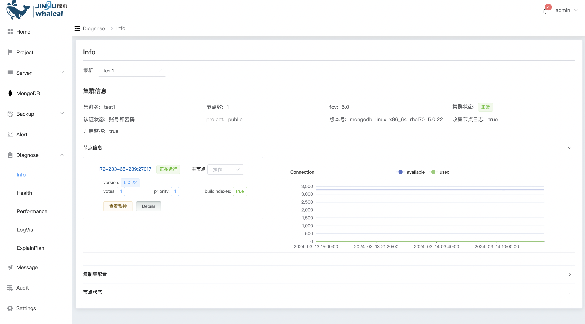
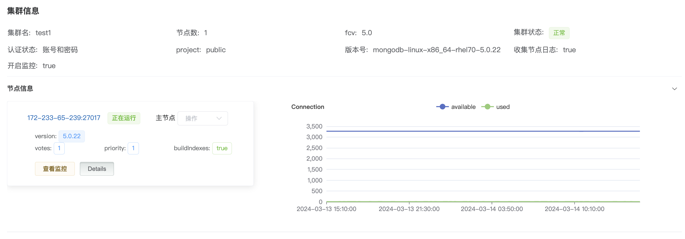
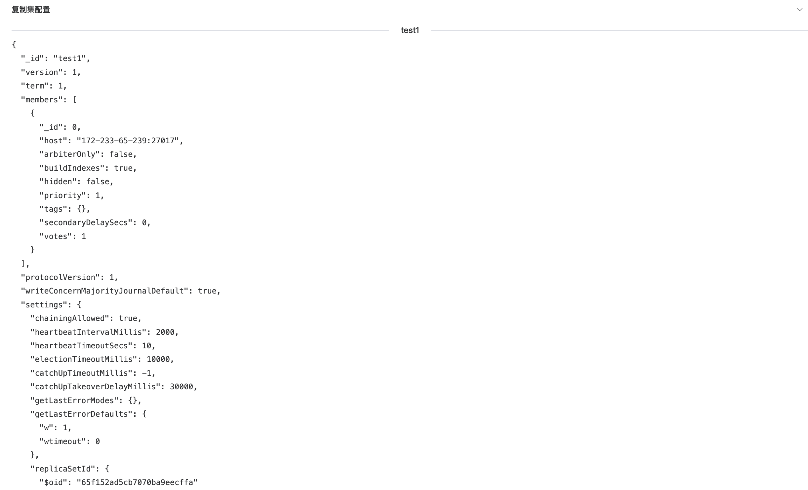
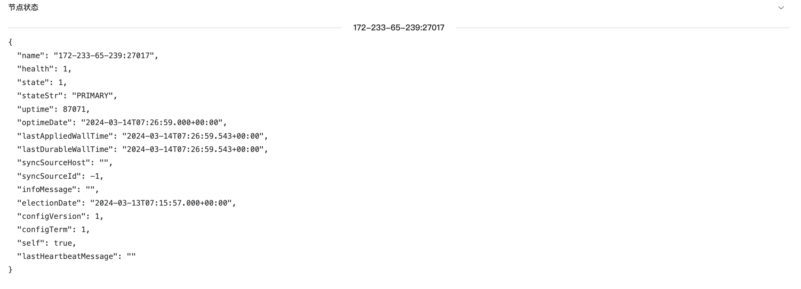

## Info

Info page

The Info page provides cluster information, replica set configuration, and node status. Administrators can view cluster summary information, replication set configuration (such as master-slave node settings), and details of each node here to help administrators fully understand the status of the MongoDB environment.

* Cluster information, including all information in the cluster

* Replication set configuration, you can see the configuration information of the current replication set

* Node status

