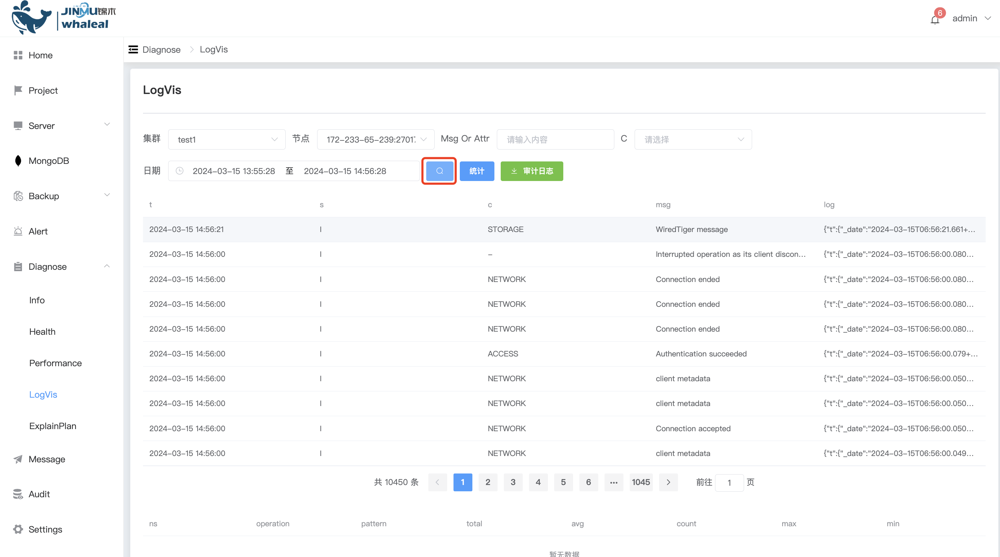
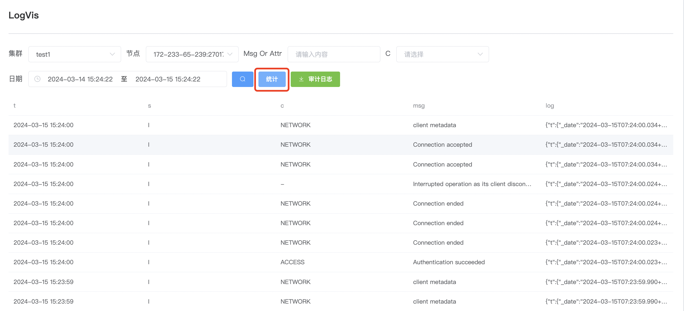
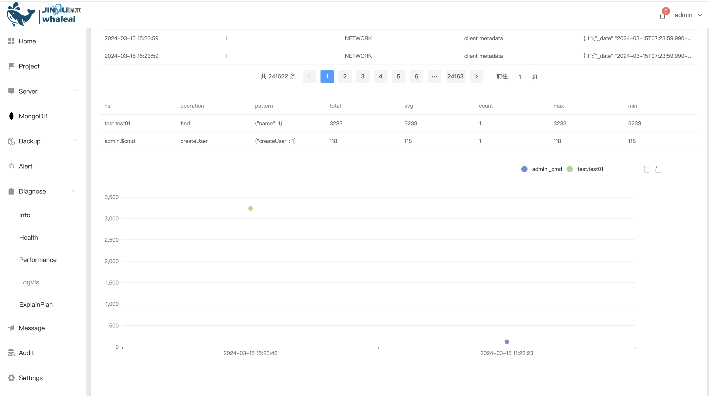
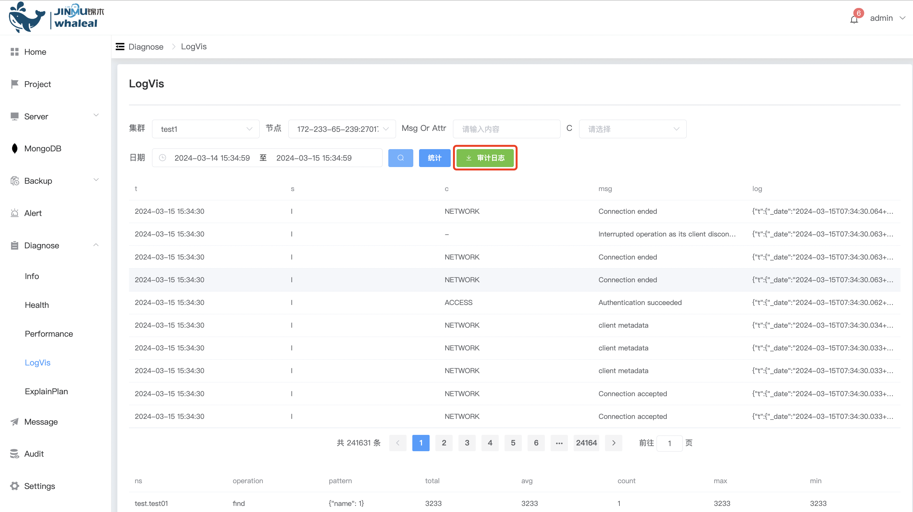

## LogVis

LogVis can view selected MongoDB log information, including filtered audit logs, slow log analysis, etc., required[Enable log collection](../MongoDB/ManageCluster/clusteroperations/Enablelogcollection.md)

View log

a. After selecting the cluster node in LogVis, click Query

Slow log analysis

a. Click statistics

b.You can view slow log analysis information below

Download audit log

a. Click Audit Log to download the audit log locally.

