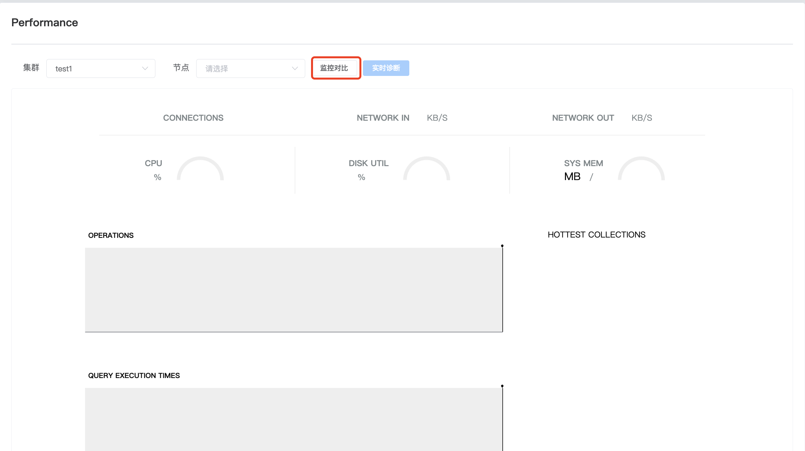

## Performance

real time monitoring

Performance real-time monitoring can track and record the performance indicators of the MongoDB database system in real time. Through real-time monitoring, administrators can discover potential performance problems in a timely manner and take corresponding measures for optimization to ensure that the database system can continue to run efficiently.

a. Select your cluster and cluster nodes

b. Click Real-time Diagnosis

**Monitoring comparison**

You can view the comparison of monitoring indicators of different nodes in a cluster.

a. Click Monitor Comparison

b. You can choose the time range, node and indicator type for monitoring

 

