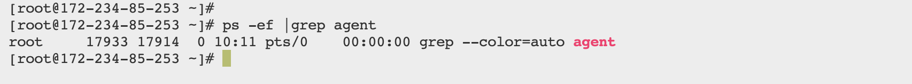
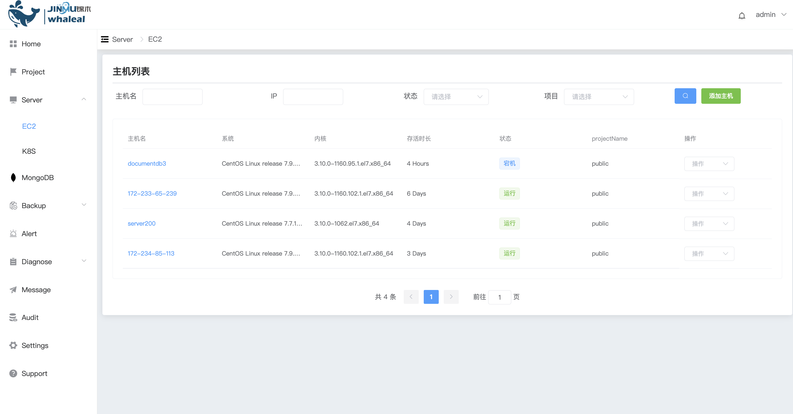

## Remove Host

```
Removing a host involves the following sections:
 - Prerequisites
 - Procedure
```

Removing a host from the platform means detaching it from management. It does not uninstall the agent from the host.

### Prerequisites

Before removing a host, check if there are any tasks related to the host that haven't been completed on the platform.


### Procedure

Step 1. Navigate to the Host Management Page

a. Click on the "Server" navigation tab to enter the host management page.

b. On the right side of the host entry, click on the "Detach Management" button (or directly terminate the agent process through the command line with caution).


Step 2. Check for Agent Process Termination

a. After detaching management, the agent process of the host will be terminated. The host will no longer be displayed in the Whaleal platform's host list. The status of MongoDB nodes associated with this host will be updated to "Detached from Management."



b. If the agent process is forcibly terminated, the host will be forcefully detached from management. The host will no longer be displayed in the platform.

