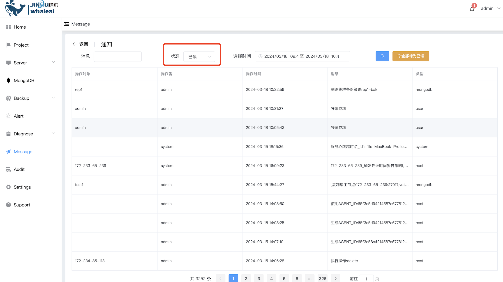

## Message

**Message notification**

Message notifications include all platform-related information, including key content such as user login information, platform operation information, and possible alarm information, aiming to promptly remind relevant parties of important developments in the system or platform. Through these notifications, users can quickly understand the activity of the system so that necessary actions can be taken in a timely manner.

View read notifications

