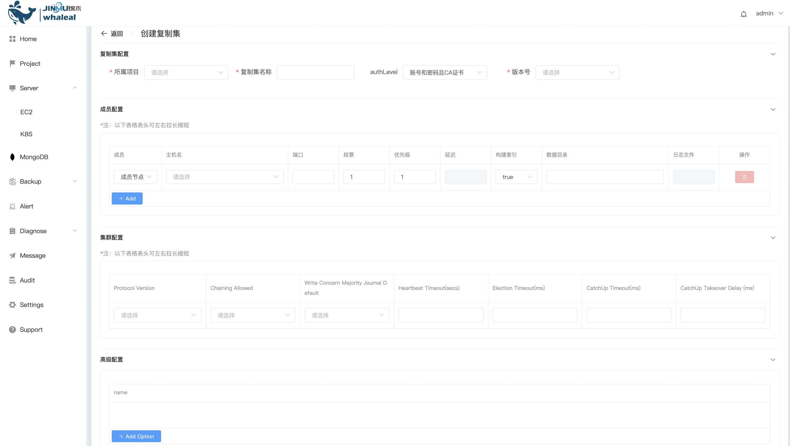
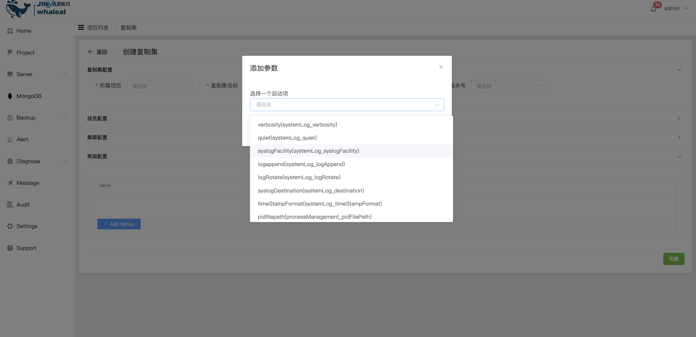

## Create ReplicaSet

```
Create ReplicaSet The operation content is divided into the following two parts:：
 - Prerequisites
 - Procedure
```

MongoDB ReplicaSet is a collection of MongoDB instances, including a master node and multiple slave nodes. The master node handles write operations and replicates data to slave nodes, providing data redundancy and high availability. If the master node is unavailable, the system will automatically select a new master node to ensure continuous operation and fault recovery of the system. The ReplicaSet deployment method provides a high availability mechanism. Recommended for use in production.

You can use WAP to create a ReplicaSet, add ReplicaSet nodes, and upgrade or downgrade them.

### Prerequisites

Before deploying ReplicaSet, you must ensure that the Host has been managed by WAP. If not, please [add EC2](../../Server/EC2.md) or [add K8S](../../Server/K8S.md) first.

Before deploying a ReplicaSet, you must ensure that a MongoTar is available in the WAP. If not, please [upload MongoTar](../../Settings/UploadMongoDBTARfile.md) first

### Procedure

**1. Enter the navigation directory**

a. Click the MongoDB options button

b. Select the MongoList option. The page displays the MongoDB Cluster that all users can operate.


**2. Create a ReplicaSet**

a. Click the Create Project button on the right

b. Select the Replica Set option


**3. Configure ReplicaSet**



Replica set configuration

| Configuration items              | value                                                        |
| -------------------------------- | ------------------------------------------------------------ |
| It's not played                  | Select the name of your project                              |
| Replica set name                 | ReplicaSet configuration replSetName                         |
| Whether to enable authentication | No authentication is enabled: Do not set user password <br/>Account number and password: Turn on authentication and set user password <br/>Account and password and CA certificate: Turn on authentication, set user password and use CA certificate |
| version number                   | Select the MongoTar corresponding to the created mongodb version |

Member configuration

| Configuration items | value                                                        |
| ------------------- | ------------------------------------------------------------ |
| member              | Replica set member type：<br>member node：The node that carries data in the replication set has voting rights and can be elected as the master node.<br/>hidden node：The node that carries data in the replication set has voting rights. The replication set configuration parameter is hidden.<br/>Hide delay nodes：The node that carries data in the replication set has voting rights. The configuration parameters of the replication set are slaveDelay and hidden. |
| hostname            | Select the host where the ReplicaSet node is deployed        |
| port                | The port used by the node                                    |
| vote                | Number of votes cast during replica set election             |
| priority            | The priority during replication set election. If the priority is 0, the node cannot be elected as the primary node. |
| Delay               | The time the node lags behind the master node (unit: seconds), only used for members who are hidden delayed nodes |
| Build index         | true：MongoDB build index<br/>false：MongoDB does not build index |
| data directory      | ReplicaSet data file storage directory (absolute path)       |
| log file            | ReplicaSet log output file                                   |
| Add                 | Add new member                                               |

Cluster configuration

| Configuration items                    | value                                                        |
| -------------------------------------- | ------------------------------------------------------------ |
| Protocol Version                       | The replication protocol version used by the replica set     |
| Chaining Allowed                       | true：Allow data to be replicated from secondary nodes<br>false：Do not allow data to be copied from secondary nodes |
| Write Concern Majority Journal Default | Whether to return after writing to the majority of nodes     |
| Heartbeat Timeout(secs)                | Heartbeat detection time between member nodes                |
| Election Timeout(ms)                   | When the member node is unreachable from the master node, check the time |
| CatchUp Timeout(ms)                    | The catch-up time between the newly elected master node and the latest write operation |
| CatchUp Takeover Delay(ms)             | After the member node leads the master node, it waits for the master node time |

Advanced configuration



a. Click the Add Option button

b. Select to add a startup configuration item and click the OK button to add it.

c. Set configuration option value

**4. Create**

Click the Create button to create a ReplicaSet.