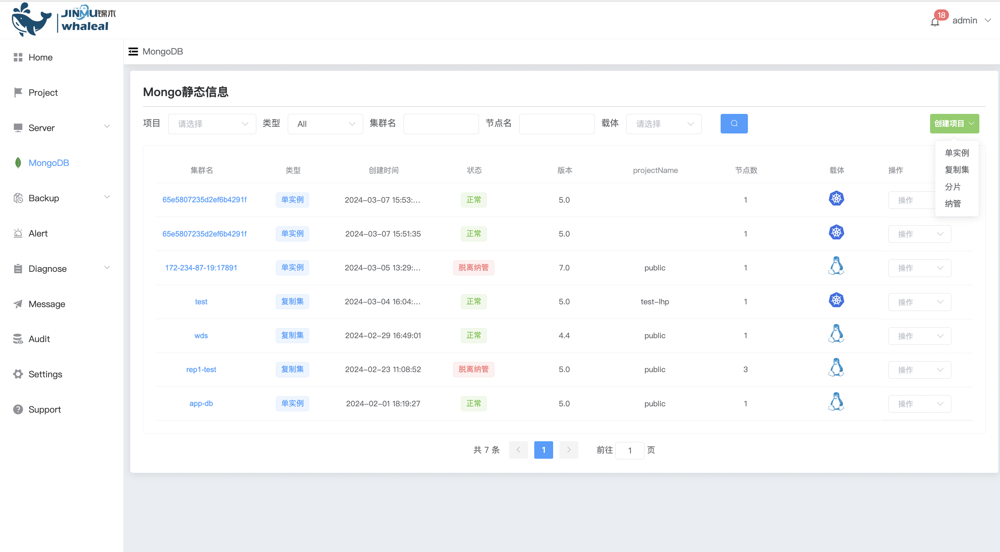
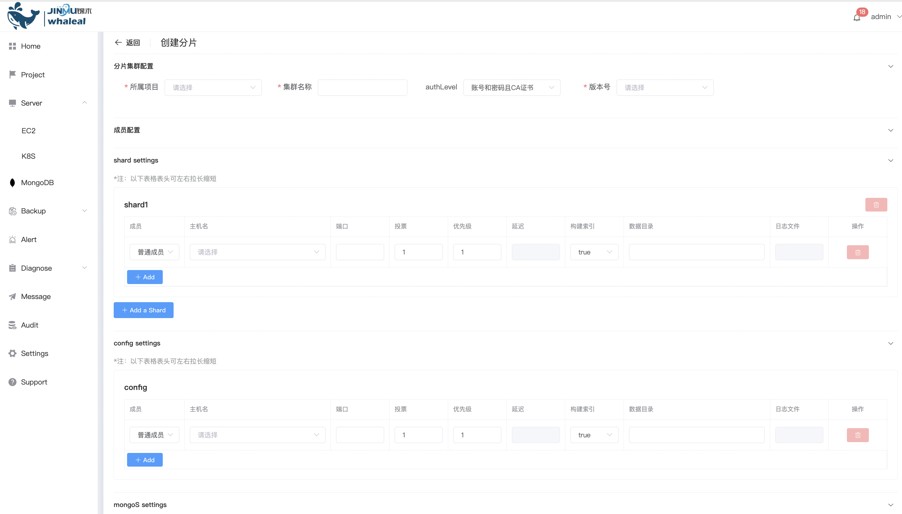
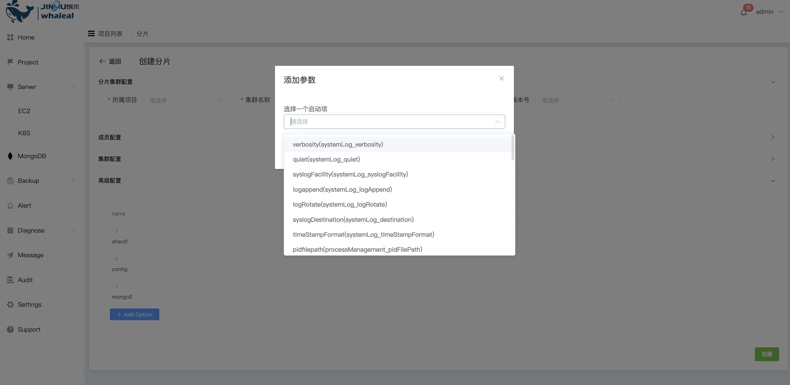

## Create Sharded Cluster

```
Create Sharded Cluster The operation content is divided into the following two parts:
 - Prerequisites
 - Procedure
```

MongoDB Sharded Cluster is a solution for scaling MongoDB database performance and capacity. It enables horizontal scalability by spreading data across multiple servers, improving the performance of read and write operations and allowing larger amounts of data to be stored. Sharded Cluster deployment method provides high availability mechanism and horizontal expansion. Recommended for use in production.

Sharded Cluster can be created using Whaleal Platform, and nodes can be added, upgraded or downgraded.

### Prerequisites

Before deploying Sharded Cluster, you must ensure that the Host has been managed by WAP. If not, please [add EC2](../../Server/EC2.md) or [add K8S](../../Server/K8S.md) first

Before deploying Sharded Cluster, you must ensure that MongoTar is available in the WAP. If not, please [upload MongoTar](../../Settings/UploadMongoDBTARfile.md) first

### Procedure

**1. Enter the navigation directory**

a. Click the MongoDB options button

b. Select the MongoList option. The page displays the MongoDB Cluster that all users can operate.



**2. Create ReplicaSet**

a. Click the Create Project button on the right

b. Select the Sharding option


**3. Configure Sharded Cluster**




Sharded cluster configuration

| Configuration items              | value                                                        |
| -------------------------------- | ------------------------------------------------------------ |
| Affiliated project               | Select the affiliated project                                |
| Cluster name                     | Sharded cluster name                                         |
| Whether to enable authentication | No authentication is enabled: Do not set user password <br/>Account number and password: Turn on authentication and set user password <br/>Account and password and CA certificate: Turn on authentication, set user password and use CA certificate |
| Version                          | Select the MongoTar corresponding to the Standalone version to create |

Member configuration

Shard Settings

| Configuration items | value                                                        |
| ------------------- | ------------------------------------------------------------ |
| member              | member type：<br>member node：Nodes that carry data have voting rights and can be elected as master nodes.<br/>hidden node：Node that carries data, has voting rights, and the configuration parameter is hidden<br/>Hide delay nodes：The node that carries data has voting rights and the configuration parameters are slaveDelay and hidden |
| hostname            | Select the host where the Sharded Cluster node is deployed   |
| port                | The port used by the node                                    |
| vote                | Number of votes cast during replica set election             |
| priority            | The priority during replication set election. If the priority is 0, the node cannot be elected as the primary node. |
| Delay               | The time the node lags behind the master node (unit: seconds), only used for members who are hidden delayed nodes |
| Build index         | true：MongoDB build index<br/>false：MongoDB does not build index |
| data directory      | Sharded Cluster node data file storage directory (absolute path) |
| log file            | Sharded Cluster node log output file (absolute path)         |
| add                 | Add member node                                              |
| add Shard           | Add a shard cluster                                          |

config Settings

| Configuration items | value                                                        |
| ------------------- | ------------------------------------------------------------ |
| member              | member type：<br>member node：Nodes that carry data have voting rights and can be elected as master nodes.<br/>hidden node：Node that carries data, has voting rights, and the configuration parameter is hidden |
| hostname            | Select the host where the Sharded Cluster node is deployed   |
| port                | The port used by the node                                    |
| vote                | Number of votes cast during replica set election             |
| priority            | The priority during replication set election. If the priority is 0, the node cannot be elected as the primary node. |
| Delay               | The time the node lags behind the master node (unit: seconds), only used for members who are hidden delayed nodes |
| Build index         | true：MongoDB build index<br/>false：MongoDB does not build index |
| data directory      | Sharded Cluster node data file storage directory (absolute path) |
| log file            | Sharded Cluster node log output file (absolute path)         |
| add                 | Add member node                                              |

Mongos Settings

| Configuration items | value                                             |
| ------------------- | ------------------------------------------------- |
| hostname            | Select the host where the mongos node is deployed |
| port                | The port used by the node                         |
| log file            | Mongos log output file (absolute path)            |
| add                 | Add mongos node                                   |

Cluster configuration

| Configuration items                    | value                                                        |
| -------------------------------------- | ------------------------------------------------------------ |
| Protocol Version                       | The replication protocol version used by the replica set     |
| Chaining Allowed                       | true：Allow data to be replicated from secondary nodes<br>false：Allow data to be replicated from secondary nodes |
| Write Concern Majority Journal Default | Whether to return after writing to the majority of nodes     |
| Heartbeat Timeout(secs)                | Heartbeat detection time between member nodes                |
| Election Timeout(ms)                   | When the member node is unreachable from the master node, check the time |
| CatchUp Timeout(ms)                    | The catch-up time between the newly elected master node and the latest write operation |
| CatchUp Takeover Delay(ms)             | After the member node leads the master node, it waits for the master node time |

Advanced configuration



a. Click the Add Option button

b. Select to add a startup configuration item and click the OK button to add it.

c. Set configuration option value


**4. Create**

Click the Create button to create a Sharded Cluster.