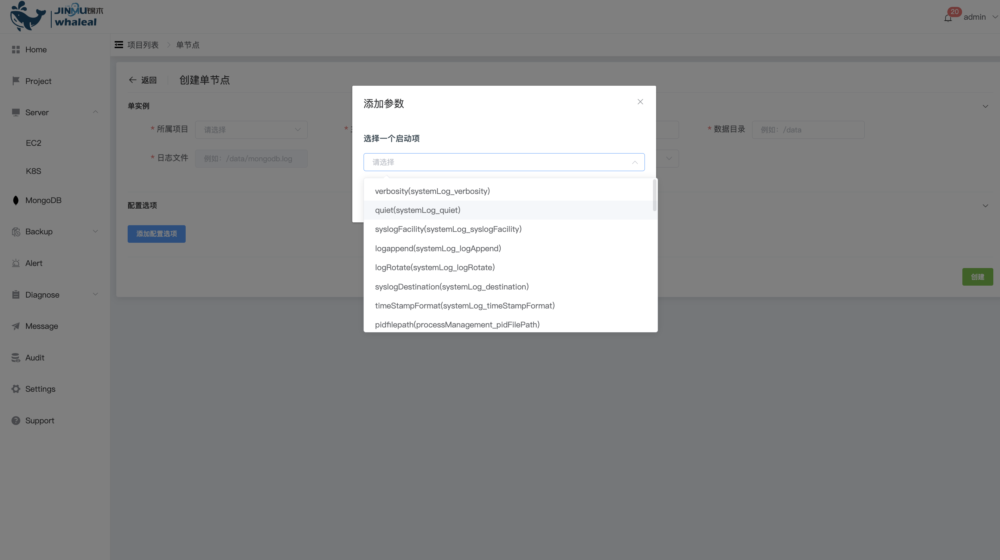

## Create Standalone

```
Create Standalone The operation content is divided into the following two parts:：
 - Prerequisites
 - Procedure
```

Standalone can be created using WAP. All data in Standalone is stored on this single node, and there is no data distribution or data redundancy. It can be used for testing and development. It is not recommended to use the Standalone deployment method in a production environment. The Standalone deployment method does not have a high availability mechanism. For production environments, it is recommended to use the [ReplicaSet](CreateReplicaSet.md) deployment method.

### Prerequisites

Before deploying Standalone, you must ensure that the Host has been managed by WAP. If not, please [Add EC2](../../Server/EC2.md) or [Add K8S](../../Server/K8S.md) first.

Before deploying Standalone, you must ensure that MongoTar is available in the WAP. If not, please [Upload MongoTar](../../Settings/UploadMongoDBTARfile.md) first.

### Procedure

**1. Enter the navigation directory**

a. Click the MongoDB options button

b. The page shows that all users can operate MongoDB Cluster


**2. Create Standalone**

a. Click the Create Project button on the right

b. Select the Single Node option

**3. Configure Standalone**


Configure the following configuration items on the page

| Configuration items       | value                                                        |
| ------------------------- | ------------------------------------------------------------ |
| Affiliated project        | Select the affiliated project                                |
| hostname                  | Select host                                                  |
| port                      | Standalone mongodb usage port                                |
| data directory            | Standalone data file storage directory (absolute path)       |
| log file                  | Standalone log output file (absolute path)                   |
| Version                   | Select the MongoTar corresponding to the Standalone version to create |
| Certification             | No authentication is enabled: Do not set user password <br/>Account number and password: Turn on authentication and set user password <br/>Account and password and CA certificate: Turn on authentication, set user password and use CA certificate |
| Add configuration options | You can add mongodb parameter configuration                  |

**4. Configuration options**



a. Click the Add Configuration Option button

b. Select to add a startup configuration item and click the OK button to add it.

c. Set configuration option value

**5. Create**

Click the Create button to create Standalone.

