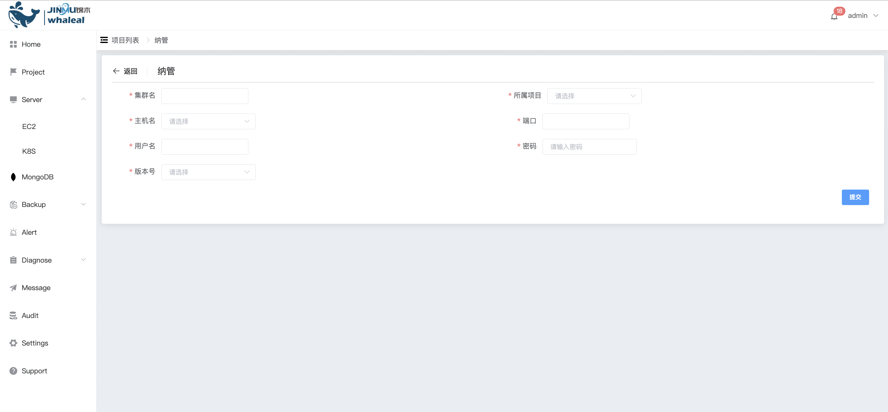

## Existing MongoDB Deployment

```
Existing MongoDB Deployment 可以执行以下操作：
 - Existing MongoDB Deployment
```

### Managed host

WAP provides a complete solution for MongoDB hosting services, allowing users to host their own MongoDB clusters on the WAP platform. WAP provides simplified management and monitoring of the MongoDB database environment, and also includes automated backup and alarm diagnosis functions to ensure data security and reliability.

**Enter navigation directory**

>  Notice: 
>
>  The managed MongoDB host cannot modify the host name. Modification will affect the WAP platform's management of the host.

a. Click the MongoDB options button

b. Select the MongoList option. The page displays the MongoDB Cluster that all users can operate.


c. Click the Create Project option button and select Manage

By configuring any node information in the cluster, Whaleal Platform will discover all nodes in the cluster and monitor and manage all nodes.



Configure the following configuration items

| Configuration items | value                                       |
| ------------------- | ------------------------------------------- |
| cluster name        | mongodb cluster name                        |
| Affiliated project  | Select the name of the affiliated project   |
| Hostname            | Select the host for deploying MongoDB nodes |
| port                | mongodb use port                            |
| username            | mongodbuser                                 |
| password            | mongodb user password                       |
| version number      | mongodb version number                      |


After configuration is complete, click the Submit button

