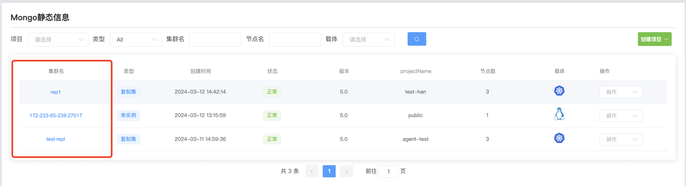
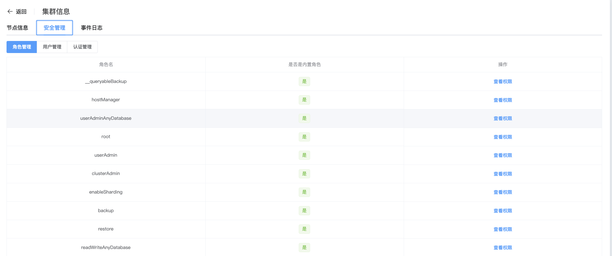
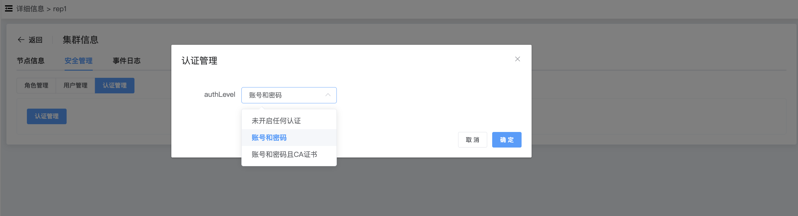

## Certification management

**Modify certification management**

You can change the way users are authenticated when connecting to the database by modifying the authentication method.

a. Click the MongoDB options button

b. Click the name of the cluster you want to modify the authentication

c. Click Security Management

d. Click Certification Management

| Configuration items                     | describe                                                     |
| --------------------------------------- | ------------------------------------------------------------ |
| No authentication is enabled            | Do not enable authentication and do not set user passwords   |
| Account number and password             | Turn on authentication and set user password                 |
| Account and password and CA certificate | Turn on authentication, set user password and use CA certificate |

e. After selecting the configuration item, click OK to modify the authentication method.