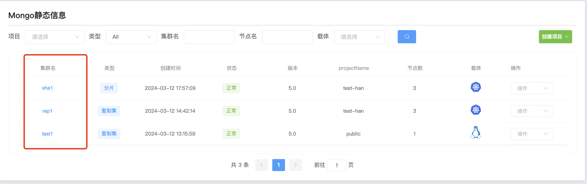

## Monitor MongoDB

**Monitor MongoDB**

Monitoring MongoDB is one of the key aspects of ensuring the health and performance of your database system. By monitoring MongoDB key metrics and resource utilization, you can detect potential problems in a timely manner and take appropriate measures to resolve them to ensure system stability and reliability.

Before using monitoring, you must first check whether the cluster [turns on monitoring](../ManageCluster/clusteroperations/Turnonmonitoring.md)

a. Click the MongoDB options button

b. Click the name of the cluster you want to monitor

c. Click to view monitoring

d. View monitoring

e. Select monitoring indicators

f. Select monitoring time range

