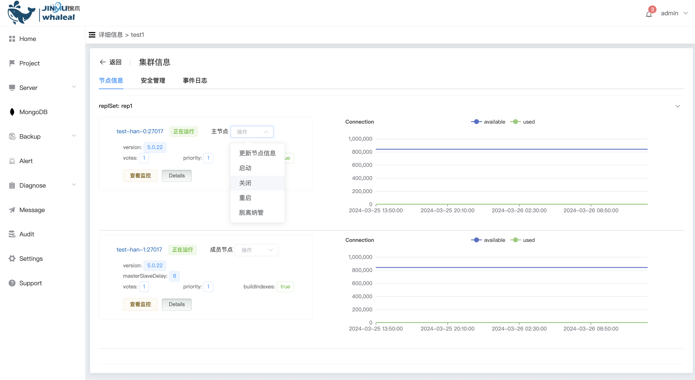

### Node operations

Operation management for a node in the cluster, including starting, shutting down, restarting, leaving management, becoming the master node, etc.

#### 1、Update node information

a. Click the MongoDB options button

b. Click the name of the cluster you want to operate

c. Click Operation and select Update node information.

d. Click OK to update the node information.

#### 2、start up

Start only the currently selected node

a. Click Actions and select Start

b. Click OK to start

#### 3、closure

Close only the currently selected node

a. Click Actions and select Close

b. Click OK to close

#### 4、Restart

Restart only the currently selected node

a. Click Actions and select Restart

b. Click OK to restart

#### 5、Get out of custody

Out of management, the selected nodes are out of management from the platform, without affecting the mongo cluster nodes in the server.

a. Click Action and select Leave Management

b.Click OK to detach from management

#### 6、Become the master node

You can upgrade the selected member node settings to become the master node

a. Click Action to choose to become the master node

b. Click OK to upgrade to the master node

