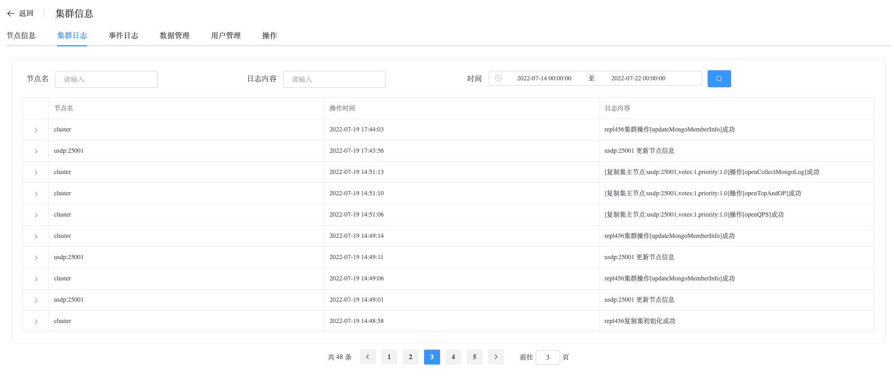

## Cluster Logs

```
Cluster Logs provide the following operation:
 - Cluster Logs
```

### Cluster Logs

View Cluster Logs data

a. Navigate to the left-side navigation bar.

b. Click on the "MongoDB" option.

c. Select the "MongoList" option.

d. On the MongoDB static information page, click on the name of the cluster with the type "ReplicaSet".

e. On the cluster information page, select "Cluster Logs".

Collect log information from all nodes within the cluster, analyze it, and confirm the cluster's status.

