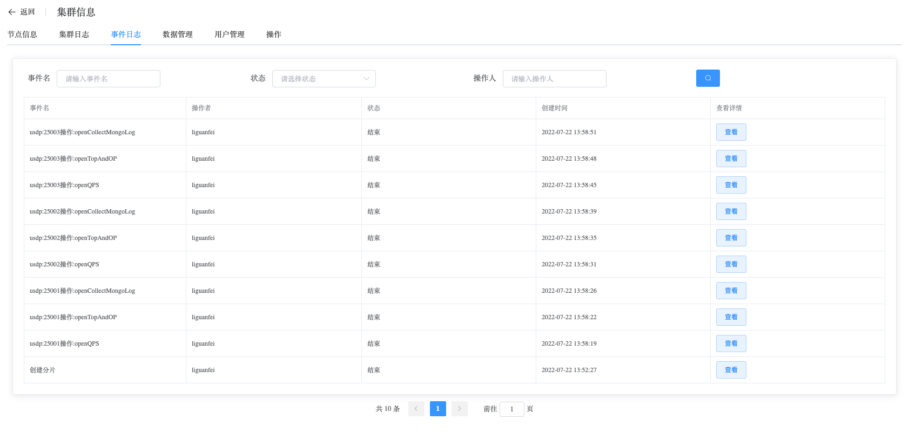
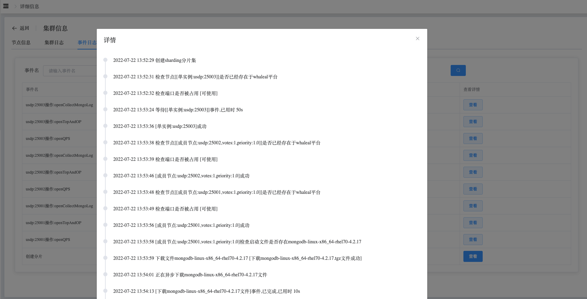

## Event Logs

```
The Event Logs section provides the following operation:
 - Event Logs
```

### Event Logs

View Event Logs data

a. Navigate to the left-side navigation bar.

b. Click on the "MongoDB" option.

c. Select the "MongoList" option.

d. On the MongoDB static information page, click on the name of the cluster with the type "Sharded Cluster".

e. On the cluster information page, select "Event Logs".

Event logs record all operations performed by users on the cluster, along with the progress and results of those operations.



By clicking the "View" button, you can see detailed information about specific events.

