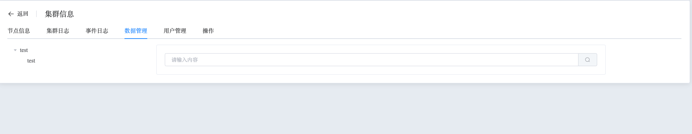
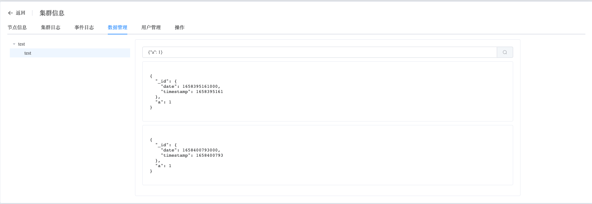

## Data

```
The Data section provides the following operation:
 - Find Data
```

### Find Data

View data within the cluster

a. Navigate to the left-side navigation bar.

b. Click on the "MongoDB" option.

c. Select the "MongoList" option.

d. On the MongoDB static information page, click on the name of the cluster with the type "Standalone".

e. On the cluster information page, select "Data Management".

You can use the page to view the data stored within the cluster, making it convenient for users to query the data.



You can enter query conditions in the input box to perform queries.

