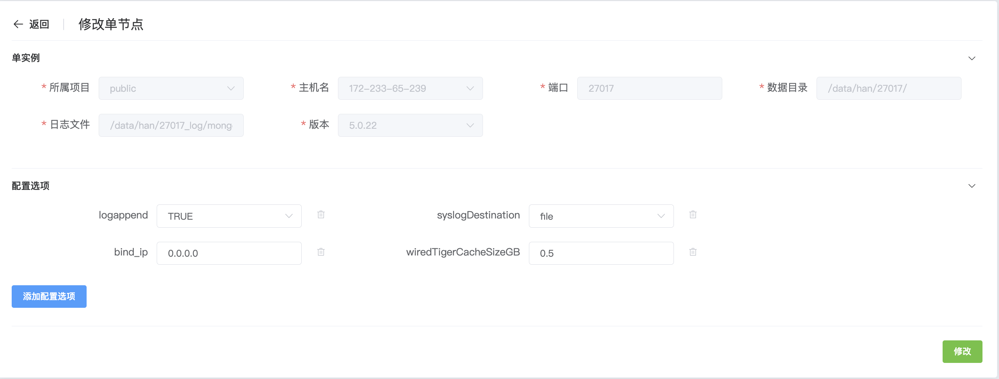
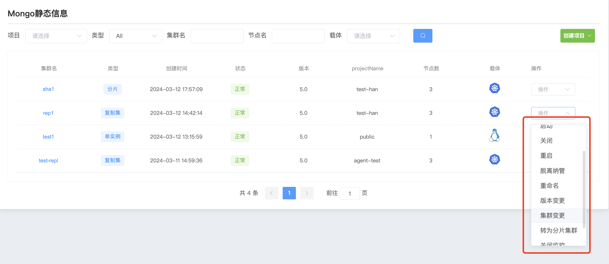
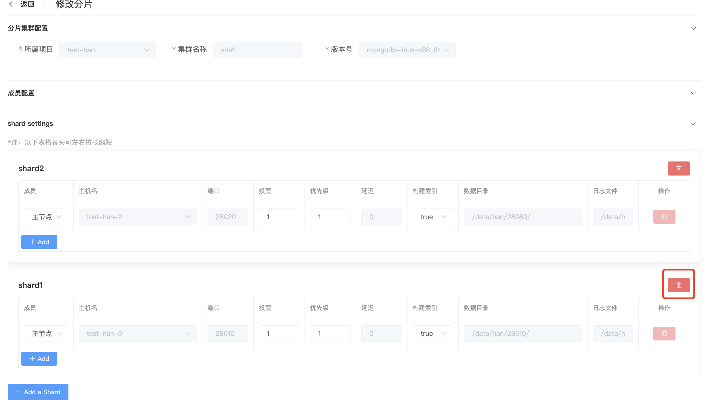

## Cluster changes

**Cluster Changes**

Cluster changes include modifying configuration parameters, adding nodes to replica sets, adding shards to sharded clusters, and other change operations.

a. Click the MongoDB options button

b. Select the cluster and click Operation Cluster Change

c. Modify the parameters in the configuration options

d. Add configuration options

e. After the configuration is completed, click Modify

Add/remove members from replica set

a. Click the MongoDB options button

b. Select the cluster and click Operation Cluster Change

* Add replica set members

  * Click member configuration +add to add new members

    

  * After the configuration is complete, click Modify

* Delete replica set members

  * Click the Delete button on the right

    

  * After the configuration is complete, click Modify

**Add/delete shards in a sharded cluster**

 a. Click the MongoDB options button

b. Select the cluster and click Operation Cluster Change

* Add shard

  * Click member configuration +add shard to add a new shard cluster

    

  * After the configuration is complete, click Modify below.

* Delete shard

  * Click the Delete button on the right

    

  * After the configuration is complete, click Modify below.

