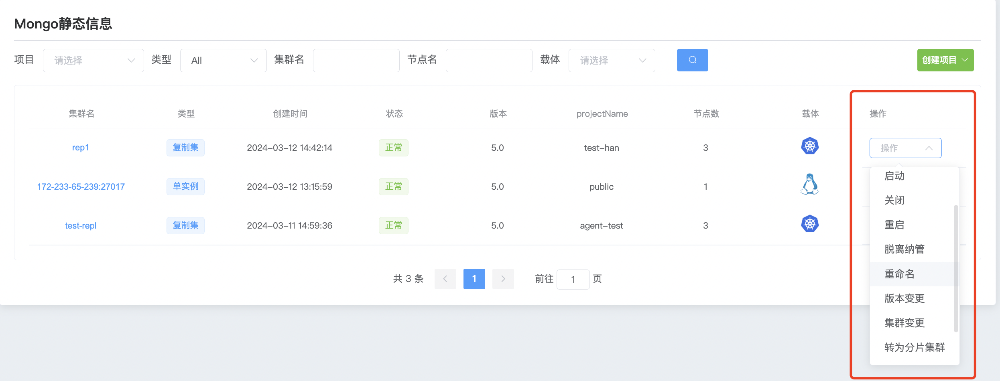
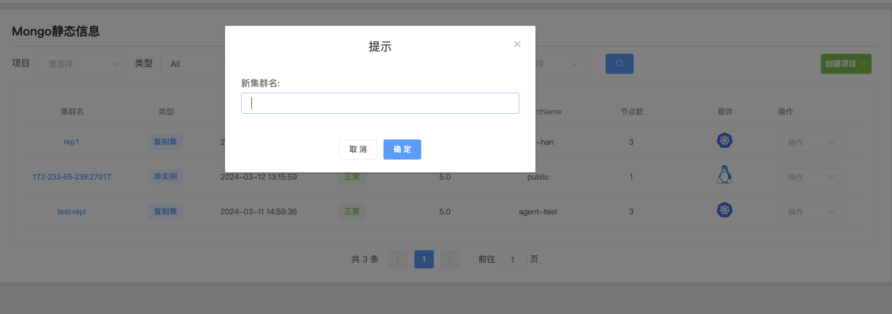

## Cluster rename

**Cluster name rename**

> Notice:
>
> Renaming only changes the cluster name on the WAP platform and does not modify the MongoDB internal cluster name.

a. Click the MongoDB options button

b. Select the cluster and click Action Rename

c. Enter the new cluster name and click Confirm

