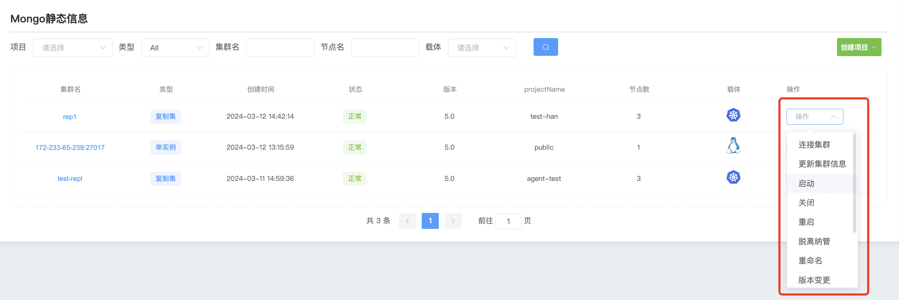
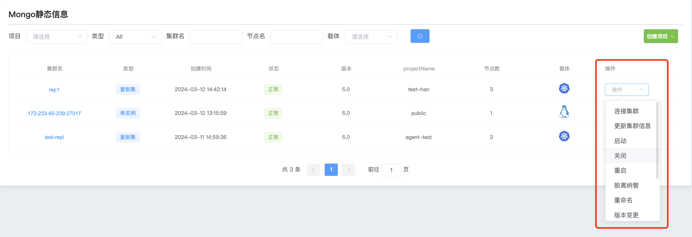
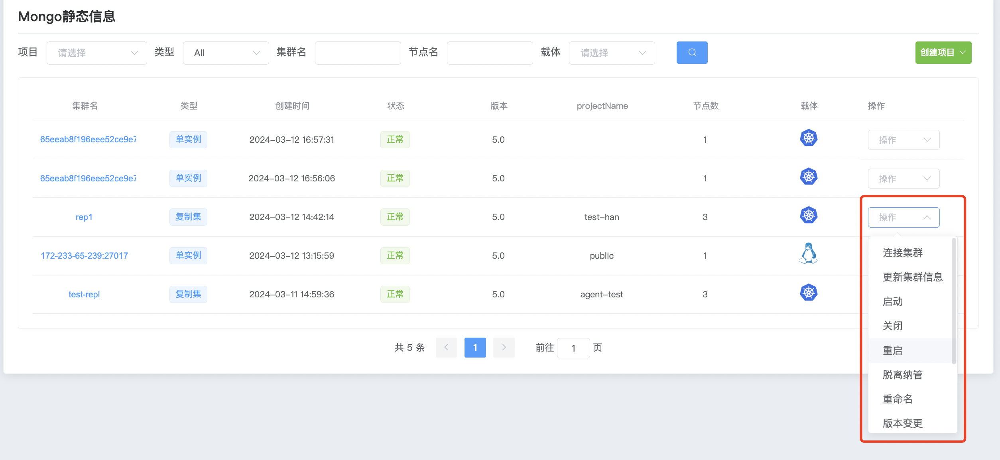

## Cluster startup shutdown

Through the operation startup/shutdown function, the entire cluster is started/shutdown, targeting all nodes in the entire cluster.

If you need to shut down/start a node in the cluster, please refer to [Node Operations](../Nodeoperations.md)

**1、Start the MongoDB cluster**

a. Click the MongoDB options button

b. Select the cluster you want to start and click Action Start

c. Click Confirm to start all mongodb services in the cluster

**2、Shut down the MongoDB cluster**

a. Click the MongoDB options button

b. Select the cluster you want to shut down and click Action Close

c. Click OK to close all mongodb services in the cluster.

**3. Restart the MongoDB cluster**

a. Click the MongoDB options button

b. Select the cluster you want to restart and click Action Restart.

c. Click Confirm to restart all mongodb services in the cluster.

