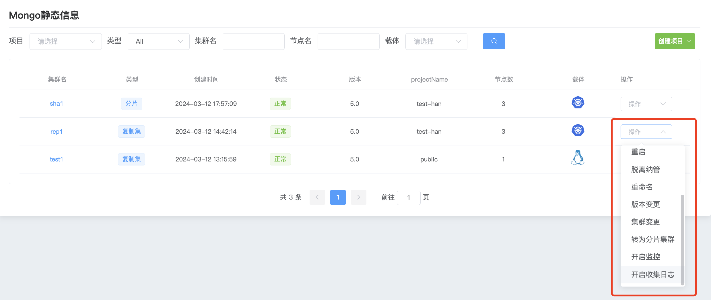
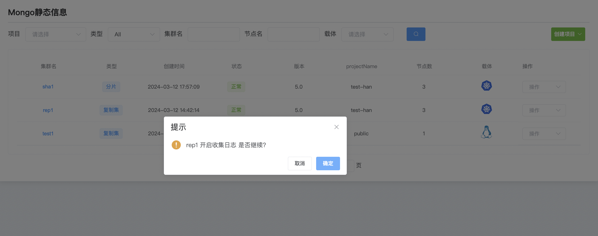

## Enable log collection

**Enable log collection**

a. Click the MongoDB options button

b. Select the cluster and click Operation to start log collection.

c. Click Confirm to start log collection

