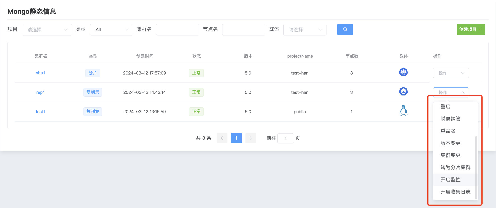
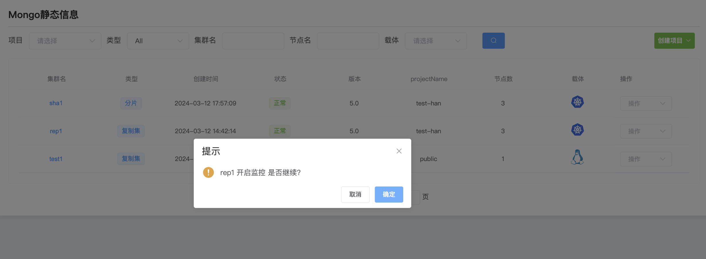

## Turn on monitoring

**Turn on monitoring**

After creating the cluster, monitoring is enabled by default. Only after enabling monitoring can you use the mongodb monitoring function to monitor your cluster.

a. Click the MongoDB options button

b. Select the cluster and click Operation to start monitoring.

c. Click Confirm to start monitoring

