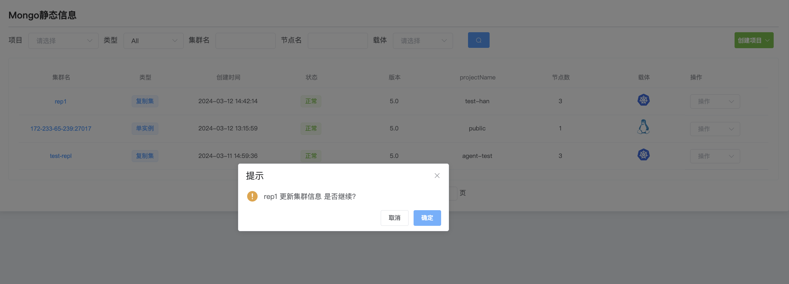

## Update cluster information

**Update cluster information**

a. Click the MongoDB options button

b. Select the cluster you want to connect to and click Action to update cluster information.

d. Click OK

