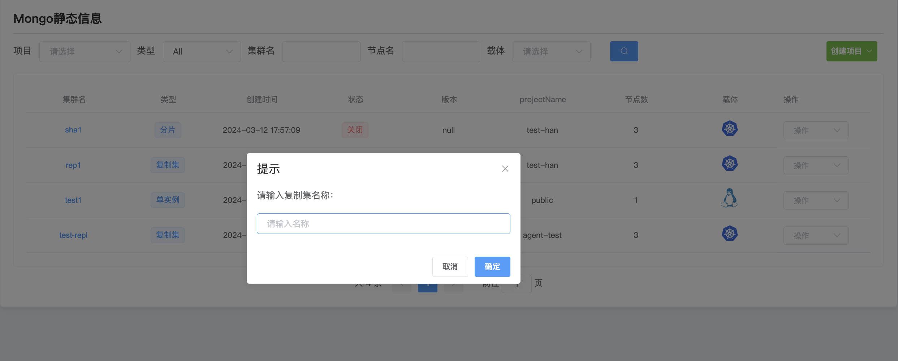

## cluster conversion

**cluster conversion**

The WAP platform supports a simple cluster conversion function, and users can easily convert a single instance of MongoDB to a MongoDB replica set, or a MongoDB replica set to a sharded cluster.

**Convert single instance to replica set**

a. Click the MongoDB options button

b. Select the cluster and click Operation to convert to replica set

c. Enter the replica set name

d. After completing the input, click Confirm to start the conversion.

**Convert replica set to shards**

a. Click the MongoDB options button

b. Select the cluster and click Operation to convert to sharded cluster

c. Fill in the configuration

To convert a replica set to a shard, a config and mongos cluster must be configured.

**Shard**

* Shard is a single node or replica set that stores data in MongoDB. There can be one or more Shards in a sharded cluster.

**Config**

* Config Servers store metadata information about the sharded cluster, including information such as shard key ranges and data shard locations. Sharded clusters usually contain 3 Config to ensure high availability.

**Mongos (MongoDB Router)**

* Mongos is the access point for clients to interact with a sharded cluster. It receives operation requests from clients and routes these requests to the correct Shard for execution.

d. After the configuration is completed, click Save to start converting the replica set to shards.