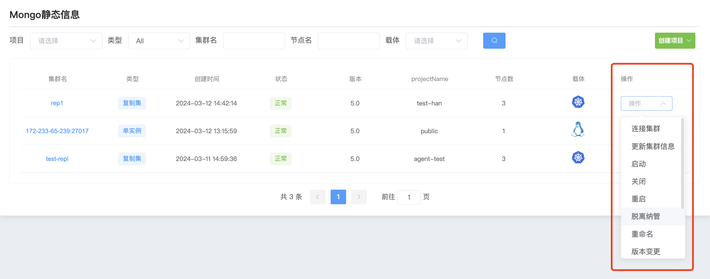
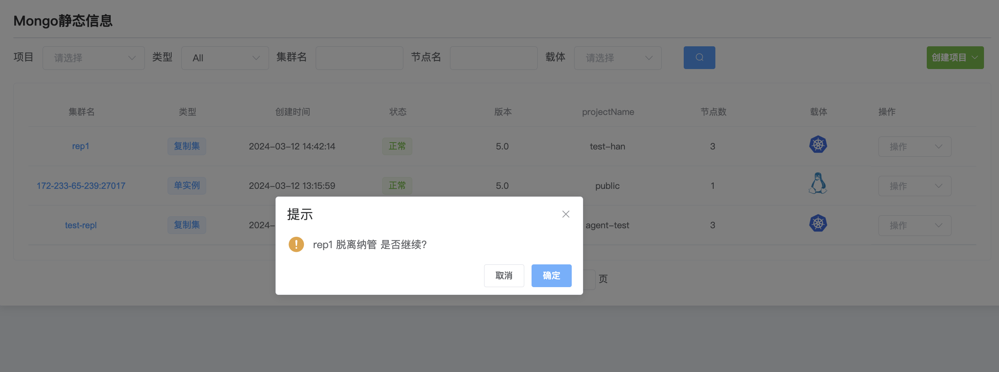

## out of management

**Get out of custody**

After the cluster is out of management, it will be deleted from the WAP platform, and the mongodb in the server host still exists.

a. Click the MongoDB options button

b. Select the cluster and click Operations to remove it from management.

c. Click to confirm and leave the management

