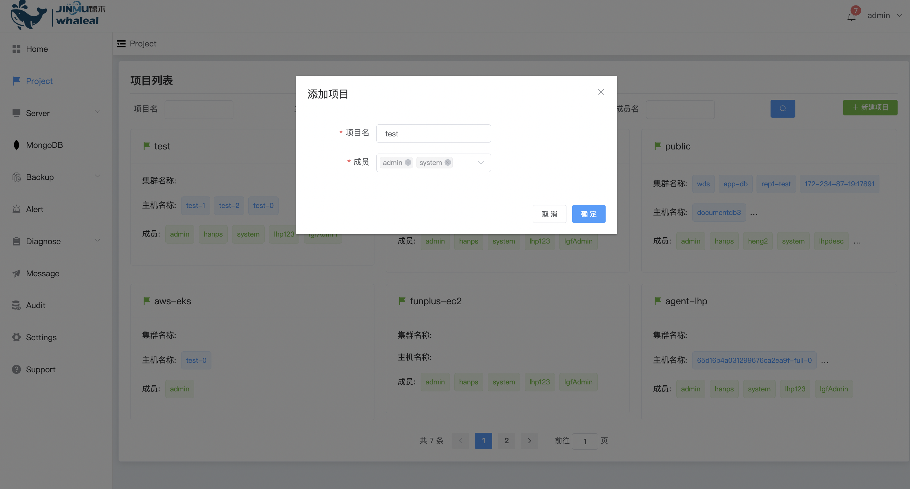

### Project

**project**

MongoDB must be created within a project, and you can add users and clusters to each project. A project can contain multiple users and clusters.

Through projects, you can define permissions and access controls to ensure that only authorized users can access and manage resources in the project. In addition, the project also supports multi-environment management, allowing you to manage different MongoDB environments in different projects.

**New Project**

Create Project and fill in the project name members

**Modify Project configuration**

Corresponding cluster information can be modified and added

Click Edit to add/delete hosts, members, and clusters

**Delete Project**

After deleting the Project, the mongodb cluster in the Project will also be deleted.

