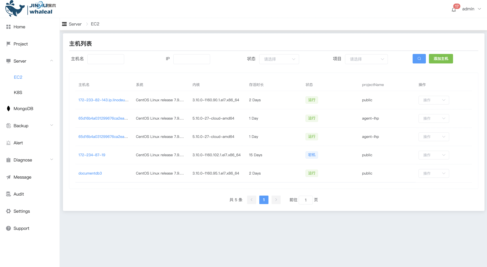
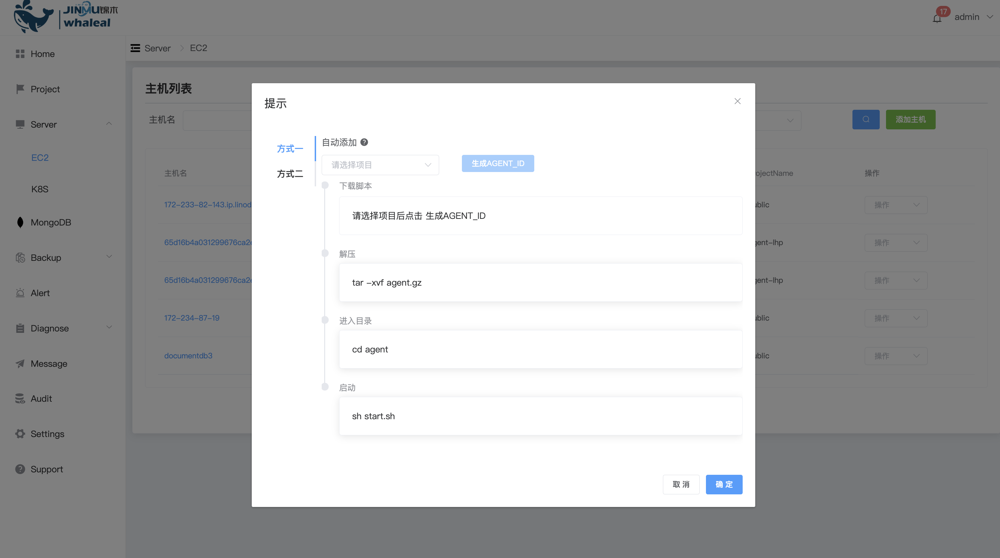
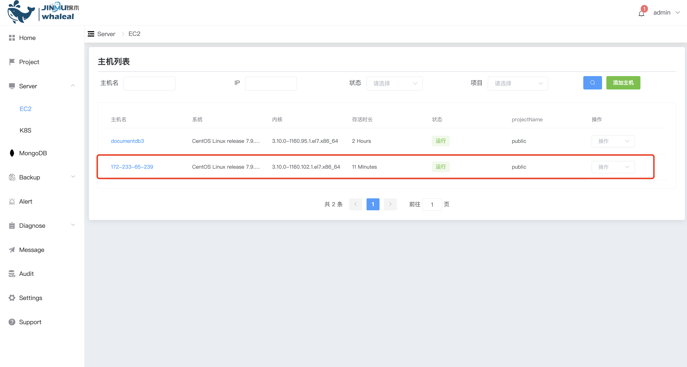
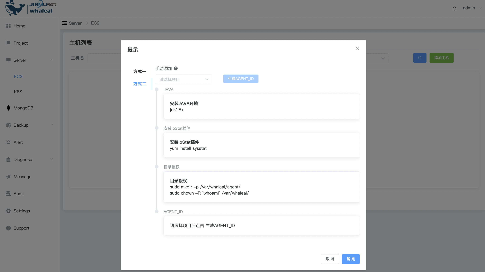
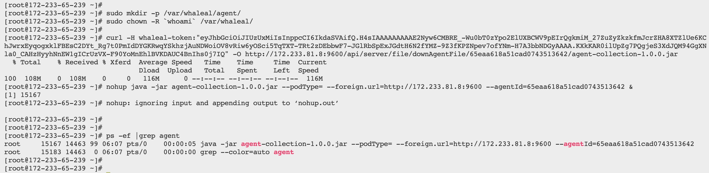
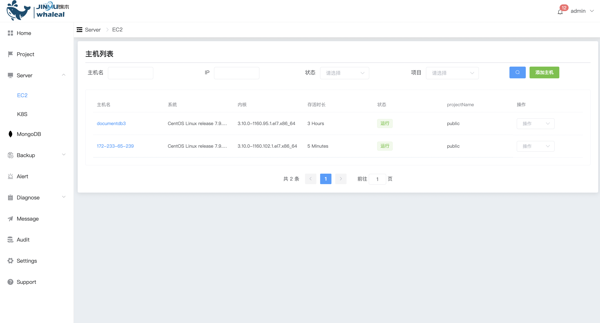

### EC2

 Adding a host can deploy mongodb to your own resource environment



**Add host**

There are two ways to add a host provider. After selecting the project to generate the agentid, follow the prompt information and click OK.

1、method one:



* Log in to the server to download the agent

  

* After executing the script, check whether the agent program is started.

  

* Log in to the WAP platform to view

  

2、Method 2:

Need to manually install the java environment and plug-ins



* Download and install java environment

  ```
  tar -zxvf jdk-11.0.9_linux-x64_bin.tar.gz -C /usr/local/
  
  vi /etc/profile
  # Add the following configuration to the last line
  export JAVA_HOME=/usr/local/jdk-11.0.9
  export CLASSPATH=.:$JAVA_HOME/lib/dt.jar:$JAVA_HOME/lib/tools.jar
  export PATH=$PATH:$JAVA_HOME/bin
  
  source /etc/profile
  
  # View current version
  java --version
  ```

* Install ioStat plug-in

  ```
  yum install sysstat
  ```

* Download agent package

  

* Check the platform after startup

  