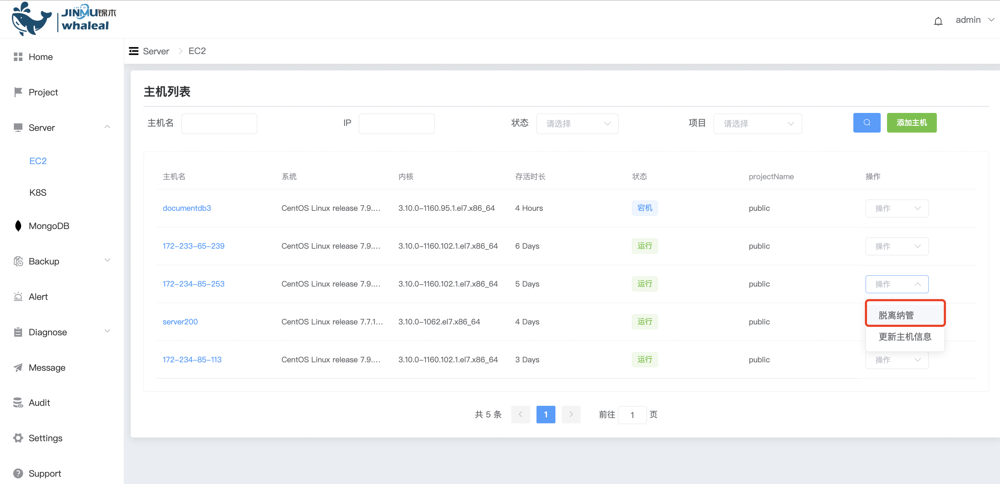

## Remove Host


```
 Remove Host The operation content is divided into the following two parts:：
 - Prerequisites
 - Procedure
```

Remove the host from the platform. This operation only does not manage the host on the platform.

### Prerequisites

Before removing a host, check if there are any outstanding tasks on the platform for the host.


### Procedure


Step-1. Enter the navigation directory

a. Click the Server navigation bar to enter the host page

b. Click on the right side to exit management (or directly use the command line to kill the agent process, operate with caution)




Step-2. After the separation is completed, check whether the host agent process is closed.


a. After leaving management, the agent process of the host will be shut down, and the host will not be displayed in the Whaleal platform host list. At the same time, the status of the MONGODB node related to the host is synchronized to "Host is out of management"


b. After the agent process is killed, the host is forcibly removed from management, and the host will not be displayed on the platform page.


