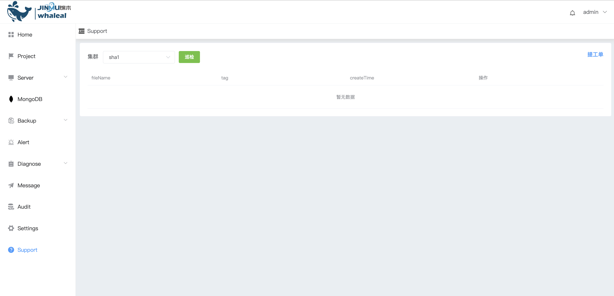

## patrol inspection

**Inspection**

Systematically review and evaluate the MongoDB database system to ensure the performance, security and reliability of the database, identify potential problems in a timely manner and take appropriate measures, and inspect mongodb files stored in S3 storage.

>  Notice:
>
> [Configuring S3](../Settings/InspectingS3configuration.md) connection information is required before inspection

a. Click Inspection

Fill in inspection notes and inspection log time range

b. After the configuration is completed, click Confirm

c.  Click Download to download the inspection log

