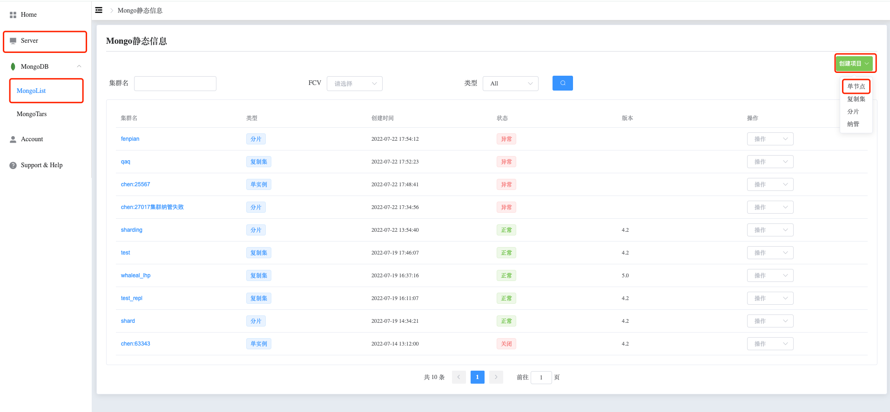

## How to Create Standalone

### Create Standalone

Step 1. Navigate to the Directory

a. Go to the left-side navigation bar.

b. Click on the "MongoDB" option.

c. Select the "MongoList" option. The page will display all MongoDB clusters that the user can operate.

Step 2. Create Standalone

a. Click on the "Create Project" button on the right side.

b. Choose the "Standalone" option.

Step 3. Configure Standalone

Fill in the cluster configuration.

Step 4. Configure Options

a. Click the "Add Configuration Option" button.

b. Select the startup configuration options to add by clicking the "Confirm" button.

c. Set the values for the configuration options.

Step 5. Create

Click the "Create" button to create the Standalone cluster.

