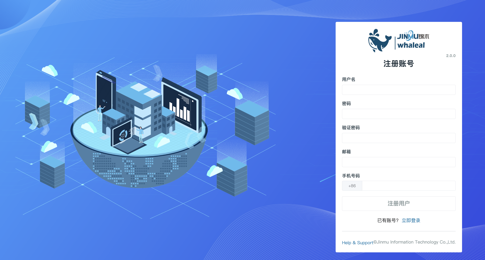
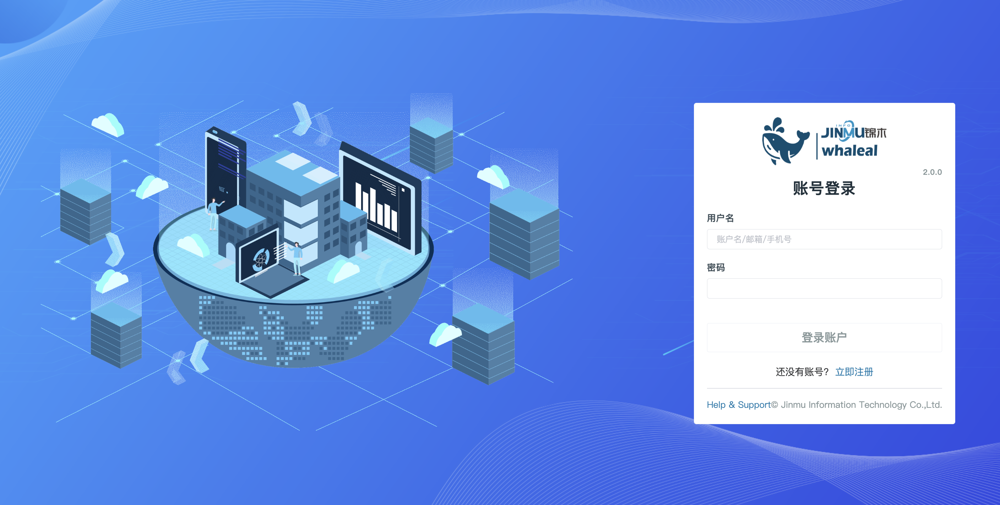

## Whaleal Platform ChangeLog

### Whaleal Platform V2.0.0

    Whaleal Platform V2.0.0。

Its platform includes functional modules as follows:
    
#### 1. Log in and register

- register


Register an account: When registering an account, there is no need to verify the correctness of the mobile phone number and email address. Only the basic format and existence are verified. It is generally recommended to fill in the mobile phone number (only mobile phone numbers in mainland China are supported) and email address.




- Log in

  Login method: mobile phone + password, email + password, account number + password.



<br>

#### 2.Home


- Host

   - Displays the survival status of the host, CPU, memory, and disk in the form of a fan chart.


- Host Summary

  - Displays the top five memory details of CPU, Memory, Disk, NetIn, and NetOut in the form of a chart.
- Mongo

  - Displays the real-time status of Mongo nodes, Mongo clusters, and Mongo cluster types in the form of a fan chart.
- MongoDB Summary

  - Displays the top five storage details of Cluster, Collection, Crashed, Qps, Connection, and Slowest in the form of a chart.

<br>

#### 3. Project

* [Project](../02-Usage/Project.md)
  * You can define permissions and access controls to ensure that only authorized users can access and manage resources in the project

#### 4. Server

* Host statistics

  - The page displays the general information of the hosts that have been managed by the platform. At the same time, you can perform operations such as updating the data of the hosts without management.

* Add host

  * [EC2](../02-Usage/Server/EC2.md)

    Add EC2 host

  * [K8S](../02-Usage/Server/K8S.md)

    Create k8s host, modify and add host resource configuration

* Host information
  * Click the host name to enter the host's details page. The page contains the host's basic information, monitoring, logs, commands, alarms, etc. Details are introduced at [HostInfos](../02-Usage/Host/HostInfos.md)
* [Get out of custody](../02-Usage/Server/RemoveHost.md)
  
  * Remove the host from the platform

<br>

#### 5.MongoDB

- Mongo static information

  - The page displays cluster information that has been managed into the platform. You can also search and locate the desired cluster, and perform different operations on the cluster. For example, operations such as updating node information, starting, shutting down, restarting, leaving management, renaming, etc.


- Create project

  - Click the Create Project button to select different cluster types to create on the platform. Creation types include single node, replica set, shard, etc. Clusters that are not managed by the platform can also be managed on the platform.
    - Detailed steps to create a single node-->[CreateStandalone](../02-Usage/MongoDB/CreateDeployment/CreateStandalone.md)
    - Detailed steps to create a replica set-->[CreateReplicaSet](../02-Usage/MongoDB/CreateDeployment/CreateReplicaSet.md)
    - Detailed steps to create shards-->[CreateShardedCluster](../02-Usage/MongoDB/CreateDeployment/CreateShardedCluster.md)
    - Steps to manage MongoDB-->[ExistingMongoDBDeployment](../02-Usage/MongoDB/CreateDeployment/ExistingMongoDBDeployment.md)

- Mongo cluster operations

  * [Connect to the cluster](../02-Usage/MongoDB/ManageCluster/clusteroperations/Connecttothecluster.md)
  * [Update cluster information](../02-Usage/MongoDB/ManageCluster/clusteroperations/Updateclusterinformation.md)
  * [Start/stop/restart the cluster](../02-Usage/MongoDB/ManageCluster/clusteroperations/Clusterstartupshutdown.md)
  * [Get out of custody](../02-Usage/MongoDB/ManageCluster/clusteroperations/outofmanagement.md)
  * [Rename](../02-Usage/MongoDB/ManageCluster/clusteroperations/Clusterrename.md)
  * [Version changes](../02-Usage/MongoDB/ManageCluster/clusteroperations/Versionchanges.md)
  * [Cluster changes](../02-Usage/MongoDB/ManageCluster/clusteroperations/Clusterchanges.md)
  * [cluster conversion](../02-Usage/MongoDB/ManageCluster/clusteroperations/clusterconversion.md)
    * Convert a single node to a replica set
    * Convert replica set to sharded cluster
  * [Turn on monitoring](../02-Usage/MongoDB/ManageCluster/clusteroperations/Turnonmonitoring.md)
  * [Enable log collection](../02-Usage/MongoDB/ManageCluster/clusteroperations/Enablelogcollection.md)

- [Mongodb monitoring](../02-Usage/MongoDB/ManageCluster/MonitorMongoDB.md)

  * Click on the cluster name --> Click on View Monitoring to see mongodb monitoring information

- Security management

  *  [User creation](../02-Usage/MongoDB/ManageCluster/UserManagement.md)

    Create mongodb user

  *  [Certification management](../02-Usage/MongoDB/ManageCluster/Certification.md)

    Modify the mongodb user authentication method such as username, password, or ca certificate
  
- [Node operations](../02-Usage/MongoDB/ManageCluster/Nodeoperations.md)

  * Perform operations such as turning on/off a single node in the cluster

<br>

#### 6.Backup

* [Backup](../02-Usage/Backuprestore/Backub.md)
  * Back up mongodb and store the backup files in S3
* [Restore](../02-Usage/Backuprestore/Restore.md)
  * Recover data from backup files

<br>

#### 7.Alert

* [Alert configuration](../02-Usage/Alert.md)
  * Add alarm configuration, which can configure host alarms, mongo alarms, and project alarms

<br>

#### 8.Diagnose

* [Info](../02-Usage/Diagnose/Info.md) 

  The info page provides cluster information, replica set configuration and node status. Administrators can view cluster summary information, replication set configuration (such as master and slave node settings), and details of each node here.

* [Health](../02-Usage/Diagnose/Health.md)

  Quickly diagnose the resources and configuration information of the current host and MongoDB. This information can help evaluate the performance, availability and health of MongoDB.

* [Performance](../02-Usage/Diagnose/Performance.md) 

  Real-time monitoring can track and record the performance indicators of the MongoDB database system in real time.

* [LogVis](../02-Usage/Diagnose/LogVis.md)

  View the slow log of the current MongoDB cluster and the MongoDB audit log

* [ExplainPlan](../02-Usage/Diagnose/ExplainPlan.md) 

  By analyzing execution plans, administrators can understand query execution, discover potential performance bottlenecks, and optimize them.

<br>

#### 9.Message

* [Platform operation notification](../02-Usage/Message.md)
  * All operational information notifications in the platform include alarms, etc.

<br>

#### 10.Audit

* [Audit list](../02-Usage/Audit.md)
  * Audit notification, including user operations, request methods, cluster operations, user login and other information

<br>

#### 11.Settings

* Media pack management
  * Mongo media package management

    - When creating a cluster, select a different mongo version to create. This version of mongo can be uploaded through the MongoTars page..
      - Steps to upload media package details-->[UploadMongoTar](../02-Usage/Settings/UploadMongoDBTARfile.md)
* [Email configuration](../02-Usage/Settings/Emailconfiguration.md)
  * Configure the alarm email. The alarm information will be sent to the user through this email.
* [Collection granularity configuration](../02-Usage/Settings/Collectiongranularityconfiguration.md)
  * Collection granularity configuration can set the frequency of data collection in monitoring
* [Kubernetes configuration](../02-Usage/Settings/Kubernetesconfiguration.md)
  * k8s configuration, to add a k8s host, you must add the Kubernetes configuration file to the WAP platform.
* [Inspecting S3 configuration](../02-Usage/Settings/InspectingS3configuration.md)
  * Inspection needs to be configured, and the inspection files are stored in S3.

<br>

#### 12.Support

* Inspection
* [Support](https://support.whaleal.com/)
  * Whaleal Support

<br>


####  13.User Center

- [Personal Center](../02-Usage/Account/AccountCenter.md)
  - The personal center page displays the personal information filled in during registration. You can change and add information on this page.
  
- [User Management](../02-Usage/Account/Users.md)
  - Only the admin account can display and operate the management page. Users can be deleted and empowered on the page.
    - Click the user name to enter the user resource page, where you can manage permissions for this user, such as adding hosts and creating clusters. You can show and hide a host or cluster for this user on the Server and Mongo pages.
  
- [Account configuration](../02-Usage/Account/Config.md)
- The account configuration page can set the time zone and whether to accept alarm notifications.

<br>

####  14. Help


- [Documentation column](https://docs.whaleal.com/)
  - Whaleal Community Documentation Column


- [Community address](https://www.whaleal.com/)
  - Whaleal Community

<br>


---
---


##### Whaleal Platform Agent V1.0.0

```


```