# File Interface

When calling this interface, you need to set the `whaleal-Token` in the request header and provide the necessary parameters to initiate the request. The returned content will be in JSON format. The special entity classes will be provided in the final entity class table.

### Default Request Header Format, Special Cases for Special Declarations

The `whaleal-Token` is returned when you call the login interface. When calling other interfaces, place the token in the request header.

[Call the login interface to get `whaleal-Token`](Member.md)

| KEY                |     VALUE      |     
| -------------------|----------------------|
| Accept-Encoding        |         gzip,deflate,br |     
| Connection          |         keep-alive           |          
| Content-Type          |multipart/form-data; boundary=\<calculated when request is sent> |    
| whaleal-token          |         "token"           |     
---

 

###  1 Upload File to Server

1.1 Request Path

POST: http://{Server-Host}:{Port}/api/server/file/web/upload/file

---

1.2 Request Parameters

| Name                |     Located in     |           Description         |     Required    |        Schema   |
| -------------------|----------------------|-------------------------------|-----------------|-----------   |
| File          |         Body           |            Uploaded File            |        Yes       |MultipartFile
| whaleal-Token          |         Params           |            Token            |        Yes       |String

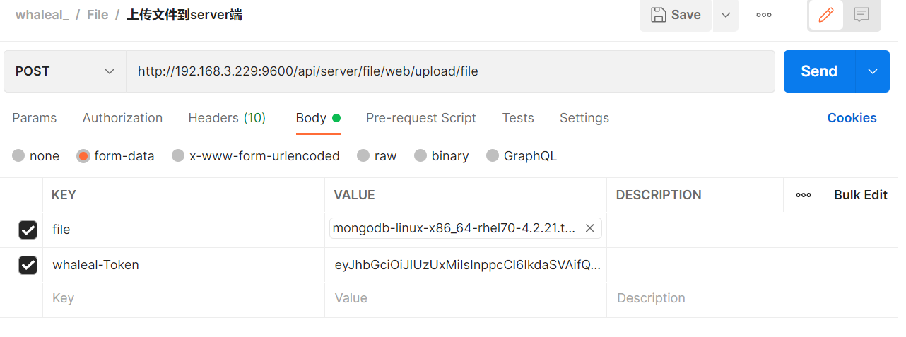

----

1.3 Response

|               |     Description    |           Schema              |  
| --------------|----------------------|---------------------------
| code        |   Status code: 1000 for success, others for exceptions |        int               |    
| msg       |         Response message         |             String           |        

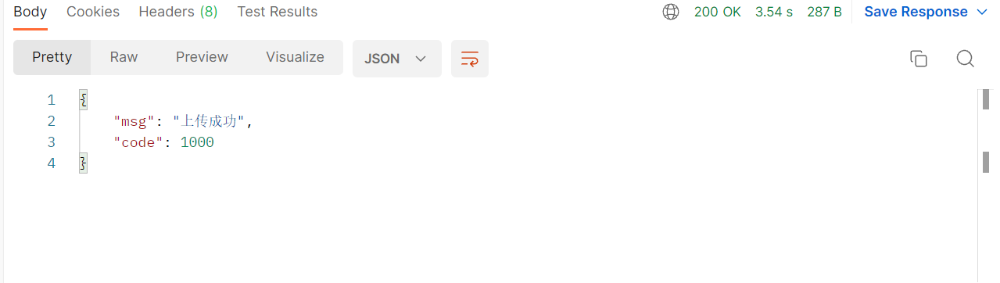

---

 

###  2 Delete Server-side File

Here, the `Content-Type` in the request header is `application/json`.

2.1 Request Path

GET: http://{Server-Host}:{Port}/api/server/file/deleteFile/{{filename}}

---

2.2 Request Parameters

| Name                |     Located in     |           Description         |     Required    |        Schema   |
| -------------------|----------------------|-------------------------------|-----------------|-----------   |
| filename          |         Path           |            File Name            |        Yes       |String        |

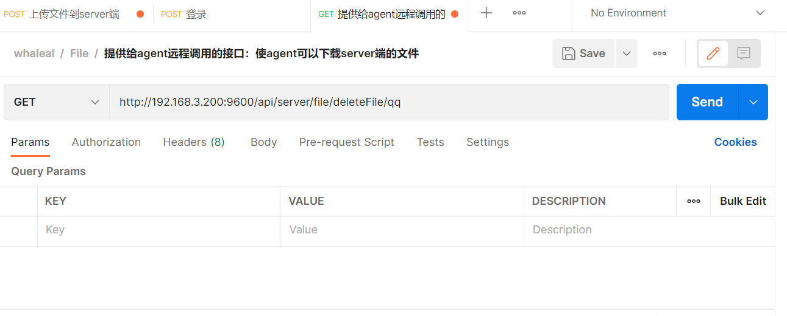

----

2.3 Response

|               |     Description    |           Schema              |  
| --------------|----------------------|---------------------------
| code        |   Status code: 1000 for success, others for exceptions |         int              |    
| msg       |         Response message         |            String            |        

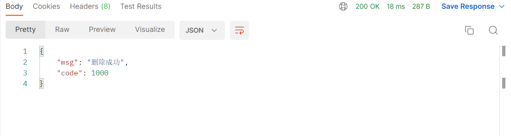

---

 

### 3 Get Server-side File Information

Here, the `Content-Type` in the request header is `application/json`.

3.1 Request Path

GET: http://{Server-Host}:{Port}/api/server/file/getAllMongoFile

---

3.2 Request

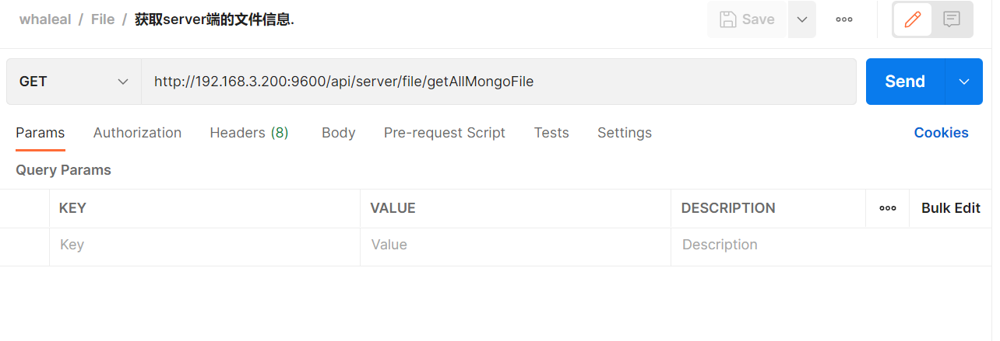

----

3.3 Response

|               |     Description    |           Schema              |  
| --------------|----------------------|---------------------------
| code        |   Status code: 1000 for success, others for exceptions |        int               |    
| data       |         Response data         |        JSON                |      

~~~
{
    "code": 1000,
    "data": [
        {
            "createTime": 1658484806756,
            "updateTime": 1658484806756,
            "name": "mongodb-linux-x86_64-rhel70-4.2.17.tgz",
            "shortName": "mongodb-linux-x86_64-rhel70-4.2.17",
            "size": 133396543,
            "md5": "1",
            "version": null,
            "path": "/home/whaleal/server/mongodb-linux-x86_64-rhel70-4.2.17.tgz",
            "hostId": "",
            "server": true
        }
    ]
}
~~~

---

 

###  4 Agents can Download Server-side Files

4.1 Request Path

GET: http://{Server-Host}:{Port}/api/server/file/agent/download/{{filename}}

---

4.2 Request Parameters

| Name                |     Located in     |           Description         |     Required    |        Schema   |
| -------------------|----------------------|-------------------------------|-----------------|-----------   |
| filename          |         Path           |            File Name            |        Yes       |String        |
| agentId          |         Header           |            AgentId         |        Yes       |String        |

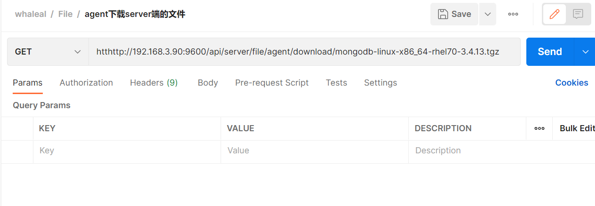

----

4.3 Response

|               |     Description

|           Schema              |  
| --------------|----------------------|---------------------------
| File       |   Binary representation of the downloaded file |        File            |

---

 

###  5 Update Server-side File Information

Here, the `Content-Type` in the request header is `application/json`.

5.1 Request Path

GET: http://{Server-Host}:{Port}/api/server/file/agent/updateAllMongoFileToAgent

---

5.2 Request

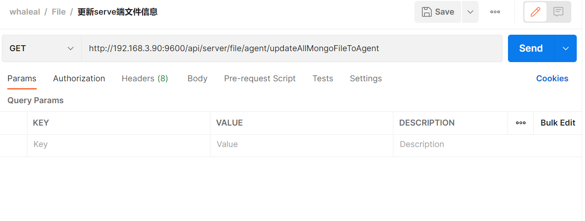

----

5.3 Response

|               |     Description    |           Schema              |  
| --------------|----------------------|---------------------------
| code        |   Status code: 1000 for success, others for exceptions |         int              |    
| msg       |         Response message         |            String            |        

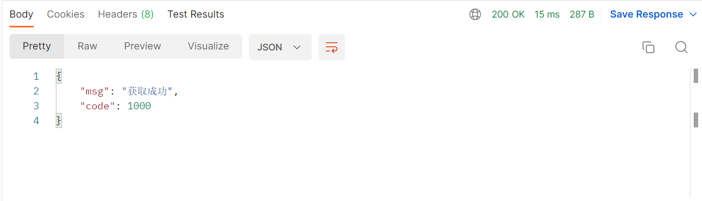

---

 

###  6 Download Inspection Logs

6.1 Request Path

GET: http://{Server-Host}:{Port}/api/server/file/download/mdiag/{{clusterId}}/{{fileID}}/{{filename}}

---

6.2 Request Parameters

| Name                |     Located in     |           Description         |     Required    |        Schema   |
| -------------------|----------------------|-------------------------------|-----------------|-----------   |
| clusterId          |         Path           |            Cluster ID            |        Yes       |String        |
| fileID          |         Path           |            File ID            |        Yes       |String        |
| filename          |         Path           |            File Name            |        Yes       |String        |
| whaleal-Token          |         Params           |            Token            |        Yes       |String        |

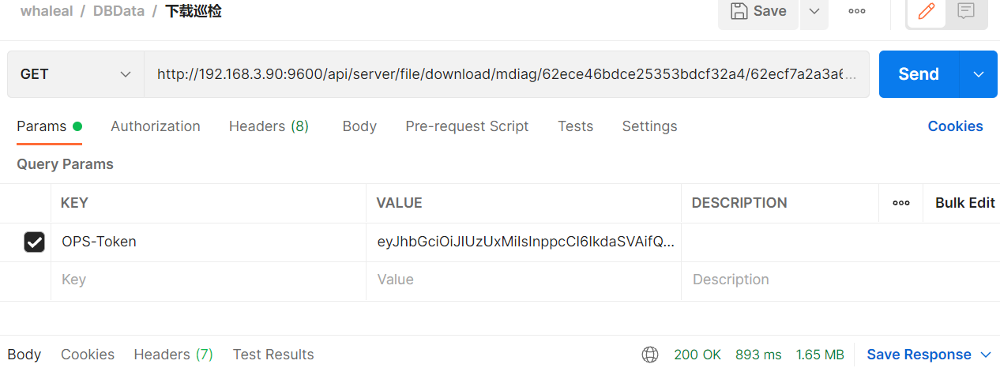

----

6.3 Response

|               |     Description    |           Schema              |  
| --------------|----------------------|---------------------------
| mdiag       |   Downloaded file in binary form |        File            |    

 

###  7 Download Mongo Cluster Files

7.1 Request Path

GET: http://{Server-Host}:{Port}/api/server/file/download/mongoClusterFile/{{clusterId}}/{{filename}}

---

7.2 Request Parameters

| Name                |     Located in     |           Description         |     Required    |        Schema   |
| -------------------|----------------------|-------------------------------|-----------------|-----------   |
| clusterId          |         Path           |            Cluster ID            |        Yes       |String        |
| filename          |         Path           |            File Name            |        Yes       |String        |
| fileIdList          |         Params           |            List of File IDs            |        Yes       |List        |
| whaleal-Token          |         Params           |            Token            |        Yes       |String        |

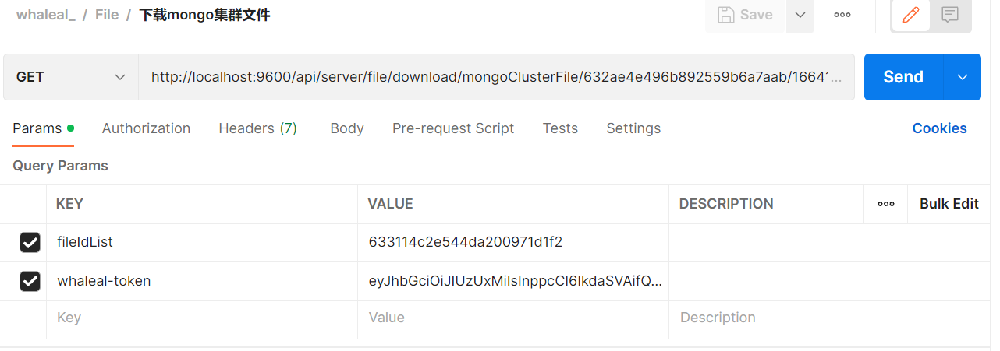

----

7.3 Response

|               |     Description    |           Schema              |  
| --------------|----------------------|---------------------------
| file       |   Downloaded file in binary form |        File            |    

 

8.1 Request Path

GET: http://{Server-Host}:{Port}/api/server/agent/downAgentFile/{{agentId}}/{{fileName}}

---

8.2 Request Parameters

| Name                |     Located in     |           Description         |     Required    |        Schema   |
| -------------------|----------------------|-------------------------------|-----------------|-----------   |
| agentId          |         Path           |            Agent ID            |        Yes       |String        |
| fileName          |         Path           |            File Name            |        Yes       |String        |

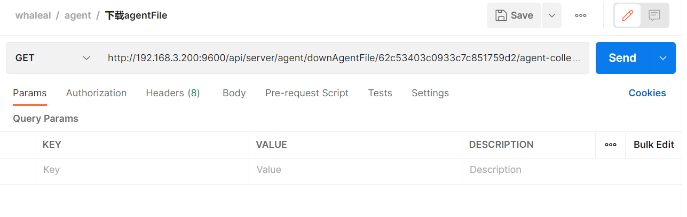

----

8.3 Response

|               |     Description    |           Schema              |  
| --------------|----------------------|---------------------------
| File       |   Binary representation of the downloaded file |       File                 |        

---

 

[comment]: <> (## MongoFile)

[comment]: <> (|       Name         |     Type             |    Description      |   )

[comment]: <> (| ------------       |----------            |---------------------|)

[comment]: <> (| shortName                 |   String             |         姓          |   )

[comment]: <> (| Name             |   String             |         名     |   )

[comment]: <> (| Size              |   Long |         大小     |   )

[comment]: <> (| Md5               |   String             |         文件校验     |   )

[comment]: <> (| version         |   String             |         版本     |   )

[comment]: <> (| Path           |   String             |         路径     |   )

[comment]: <> (| hostId             |   String             |         主机id     |   )

[comment]: <> (---)

[comment]: <> (---)