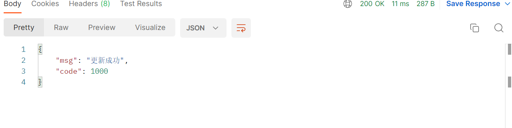
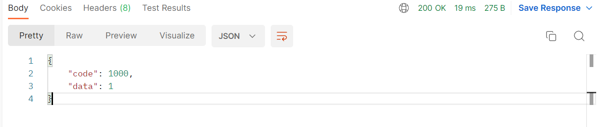
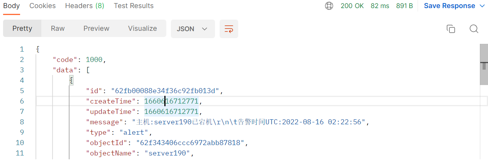
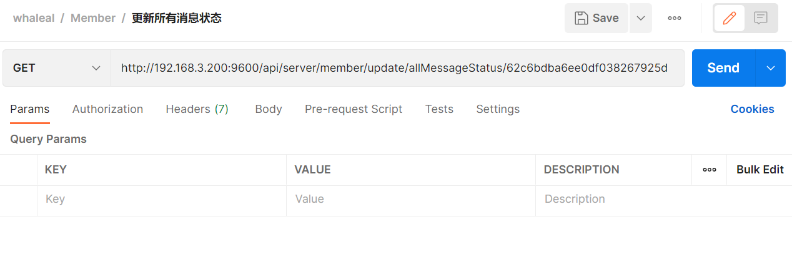

## Member Interface

When making requests to this interface, you need to set the `whaleal-Token` in the request header and provide the required parameters to initiate the request. The returned content will be in JSON format. Special entity classes will be provided in the final entity class table.

### Default Request Header Format, Special Cases for Special Declarations

The `whaleal-Token` is returned when you call the login interface. When calling other interfaces, place the token in the request header.

[Call the login interface to get `whaleal-Token`](#1-login)

| KEY                |     VALUE      |     
| -------------------|----------------------|
| Accept-Encoding        |         gzip,deflate,br |     
| Connection          |         keep-alive           |          
| Content-Type          |         application/json |    
| whaleal-token          |         "token"           |     

---

<br>

###  1 Login

1.1 Request Path

POST: http://{Server-Host}:{Port}/api/server/member/login

---

1.2 Request Parameters

| Name                |     Located in     |           Description         |     Required    |        Schema   |
| -------------------|----------------------|-------------------------------|-----------------|-----------   |
| account          |         Body           |            Account Name            |        Yes       |String        |
| password          |         Body           |            Password            |        Yes       |String        |


----

1.3 Response

|               |     Description    |           Schema              |  
| --------------|----------------------|---------------------------
| code        |   Status code: 1000 for success, others for exceptions |         int              |    
| data       |         Response data         |       JSON                 |        
| generateAgentIdAble       |         Whether the user has permission to generate agentId         |         boolean               |        
| token       |         Token token         |         String               |   
| createMongoDBAble       |         Whether the user has permission to create a MongoDB cluster         |         boolean               |   

~~~
{
    "code": 1000,
    "data": {
        "id": "62be61c7cbeff906da28f6ff",
        "createTime": 1656644040004,
        "updateTime": 1657690356662,
        "account": "chen123",
        "password": "",
        "email": "1q@q.com",
        "areaCode": "86",
        "phone": "17698999999",
        "role": "admin",
        "timezone": "Asia/Shanghai",
        "receiveAlert": true,
        "dingDingList": []
    },
    "createMongoDBAble": true,
    "generateAgentIdAble": true,
    "token": ""
}
~~~

---

<br>

### 2 Save New User Information

2.1 Request Path

POST: http://{Server-Host}:{Port}/api/server/member/register

---

2.2 Request Parameters

| Name                |     Located in     |           Description         |     Required    |        Schema   |
| -------------------|----------------------|-------------------------------|-----------------|-----------   |
| memberMongoEntity          |         Body           |            User entity object            |        Yes       |MemberMongoEntity        |


~~~
Example: Save new user information; where MemberMongoEntity is as follows:
{
    "account": "chen123556",
    "password": "123456",
    "email": "123356789@qq.com",
    "phone": "17699969999"
}
~~~

----

2.3 Response

|               |     Description    |           Schema              |  
| --------------|----------------------|---------------------------
| code        |   Status code: 1000 for success, others for exceptions |         int              |    
| data       |         Response data         |       JSON                 |        

~~~
{
    "code": 1000,
    "data": {
        "id": "62da7bd6239d00094230b525",
        "createTime": 1658485718459,
        "updateTime": 1658485718459,
        "account": "chen123556",
        "password": "",
        "email": "123356789@qq.com",
        "areaCode": "86",
        "phone": "17699969999",
        "role": "admin",
        "timezone": "Asia/Shanghai",
        "receiveAlert": true,
        "dingDingList": []
    }
}
~~~

---

<br>

###  3 Update User Information

3.1 Request Path

POST: http://{Server-Host}:{Port}/api/server/member/update

---

3.2 Request Parameters

| Name                |     Located in     |           Description         |     Required    |        Schema   |
| -------------------|----------------------|-------------------------------|-----------------|-----------   |
| memberMongoEntity          |         Body           |            User entity object            |        Yes       |MemberMongoEntity        |


~~~
Example: Update user information; where MemberMongoEntity is as follows:
{
    "id": "62be61c7cbeff906da28f6ff",
    "createTime": 1659602792412,
    "updateTime": 1659605792412,
    "account": "chen123",
    "password": "",
    "email": "110236111@qq.com",
    "areaCode": "86",
    "phone": "17699999999",
    "role": "admin",
    "timezone": "A1",
    "receiveAlert": true,
    "dingDingList": [
        "_"
    ],
    "avatar": ""
}
~~~

----

3.3 Response

|               |     Description    |           Schema              |  
| --------------|----------------------|---------------------------
| code        |   Status code: 1000 for success, others for exceptions |         int              |    
| data       |         Response data         |       JSON                 |        

~~~
{
    "code": 1000,
    "data": {
        "id": "62da7bd6239d00094230b525",
        "createTime": 1658485718459,
        "updateTime": 1658486089634,
        "account": "chen123556",
        "password": "",
        "email": "98765221@qq.com",
        "areaCode": "86",
        "phone": "17699954999",
        "role": "admin",
        "timezone": "Asia/Shanghai",
        "receiveAlert": true,
        "dingDingList": []
    }
}
~~~

---

<br>

###  4 Search Users

4.1 Request Path

POST: http://{Server-Host}:{Port}/api/server/member/findMemberData/{{pageSize}}/{{pageIndex}}

---

4.2 Request Parameters

| Name                |     Located in     |           Description         |     Required    |        Schema   |
| -------------------|----------------------|

-------------------------------|-----------------|-----------   |
| pageSize          |         Path           |            Page size            |        Yes       |int        |
| pageIndex          |         Path           |            Page index            |        Yes       |int        |
| map          |         Body           |            User information            |       Yes     |Map        |


~~~
Example: Search users; where Map is as follows:
{
    "account": "chen",
    "phone": "176",
    "email": "11"
}
~~~

----

4.3 Response

|               |     Description    |           Schema              |  
| --------------|----------------------|---------------------------
| code        |   Status code: 1000 for success, others for exceptions |         int              |    
| data       |         Response data         |       List                 |        

~~~
{
    "code": 1000,
    "data": [
        {
            "id": "62d8b50b239d00094230b37c",
            "createTime": 1658369291763,
            "updateTime": 1658369291763,
            "account": "chen123456",
            "password": null,
            "email": "123456789@qq.com",
            "areaCode": "86",
            "phone": "17699999999",
            "role": "admin",
            "timezone": "Asia/Shanghai",
            "receiveAlert": true,
            "dingDingList": []
        }
    ]
}
~~~

---

<br>

###  5 Query User Count

5.1 Request Path

POST: http://{Server-Host}:{Port}/api/server/member/findMemberCount

---

5.2 Request Parameters

| Name                |     Located in     |           Description         |     Required    |        Schema   |
| -------------------|----------------------|-------------------------------|-----------------|-----------   |
| map          |         Body           |            User information            |       Yes     |Map        |


~~~
Example: Search user count; where Map is as follows:
{
    "account": "chen",
    "phone": "",
    "email": ""
}
~~~

----

5.3 Response

|               |     Description    |           Schema              |  
| --------------|----------------------|---------------------------
| code        |   Status code: 1000 for success, others for exceptions |         int              |    
| data       |         Number of users         |       long                 |        


---

<br>

###  6 Update Receive Alerts

6.1 Request Path

GET: http://{Server-Host}:{Port}/api/server/member/update/receiveAlert/{{memberId}}/{{value}}

---

6.2 Request Parameters

| Name                |     Located in     |           Description         |     Required    |        Schema   |
| -------------------|----------------------|-------------------------------|-----------------|-----------   |
| memberId          |         Path           |            User ID            |        Yes       |String        |
| value          |         Path           |            Enable or disable            |        Yes       |boolean        |


----

6.3 Response

|               |     Description    |           Schema              |  
| --------------|----------------------|---------------------------
| code        |   Status code: 1000 for success, others for exceptions |       int                |    
| msg       |         Response message|           String             |        


---

<br>

###  7 Update Timezone

7.1 Request Path

GET: http://{Server-Host}:{Port}/api/server/member/update/timezone/{{memberId}}

---

7.2 Request Parameters

    timezone: Asia/Shanghai

| Name                |     Located in     |           Description         |     Required    |        Schema   |
| -------------------|----------------------|-------------------------------|-----------------|-----------   |
| memberId          |         Path           |            User ID            |        Yes       |String        |
| timezone          |         Params           |            Timezone            |        Yes       |String        |


----

7.3 Response

|               |     Description    |           Schema              |  
| --------------|----------------------|---------------------------
| code        |   Status code: 1000 for success, others for exceptions |       int                |    
| msg       |         Response message|          String              |        


---

<br>

###  8 Update Role

8.1 Request Path

GET: http://{Server-Host}:{Port}/api/server/member/update/role/{{memberId}}/{{value}}

---

8.2 Request Parameters

    value: user, admin

| Name                |     Located in     |           Description         |     Required    |        Schema   |
| -------------------|----------------------|-------------------------------|-----------------|-----------   |
| memberId          |         Path           |            User ID            |        Yes       |String        |
| value          |         Path           |            Role            |        Yes       |String        |


----

8.3 Response

|               |     Description    |           Schema              |  
| --------------|----------------------|---------------------------
| code        |   Status code: 1000 for success, others for exceptions |            int           |    
| msg       |         Response message|           String             |    


---

<br>

###  9 Update MongoDB Creation Permission

9.1 Request Path

GET: http://{Server-Host}:{Port}/api/server/member/update/createMongoDBAble/{{memberId}}/{{value}}

---

9.2 Request Parameters

| Name                |     Located in     |           Description         |     Required    |        Schema   |
| -------------------|----------------------|-------------------------------|-----------------|-----------   |
| memberId          |         Path           |            User ID            |        Yes       |String        |
| value          |         Path           |            Enable or disable            |        Yes       |boolean        |


----

9.3 Response

|               |     Description    |           Schema              |  
| --------------|----------------------|---------------------------
| code        |   Status code: 1000 for success, others for exceptions |        int               |    
| msg       |         Response message|            String            |    



---

<br>

###  10 Update Generate AgentId Permission

10.1 Request Path

GET: http://{Server-Host}:{Port}/api/server/member/update/generateAgentIdAble

/{{memberId}}/{{value}}

---

10.2 Request Parameters

| Name                |     Located in     |           Description         |     Required    |        Schema   |
| -------------------|----------------------|-------------------------------|-----------------|-----------   |
| memberId          |         Path           |            User ID            |        Yes       |String        |
| value          |         Path           |            Enable or disable            |        Yes       |boolean        |


----

10.3 Response

|               |     Description    |           Schema              |  
| --------------|----------------------|---------------------------
| code        |   Status code: 1000 for success, others for exceptions |          int             |    
| msg       |         Response message|         String               |    


---


#### 11 Update User Resource Information

**11.1 Request Path**

GET: http://{Server-Host}:{Port}/api/server/member/update/userResourceInfo/{{memberId}}/{{objectId}}/{{type}}/{{value}}

**11.2 Request Parameters**

- value: read, write, null
- type: mongodb, host

| Name       | Located in | Description             | Required | Schema  |
| ---------- | ---------- | ----------------------- | -------- | ------- |
| memberId   | Path       | User ID                 | Yes      | String  |
| objectId   | Path       | ID based on type        | Yes      | String  |
| type       | Path       | Type                    | Yes      | String  |
| value      | Path       | Permission              | Yes      | String  |


**11.3 Response**

|             | Description                 | Schema   |
| ----------- | --------------------------- | -------- |
| code        | Status code: 1000 for success, others for errors | int      |
| msg         | Response message            | String   |


#### 12 Delete User

**12.1 Request Path**

GET: http://{Server-Host}:{Port}/api/server/member/delete/user/{{memberId}}

**12.2 Request Parameters**

| Name       | Located in | Description  | Required | Schema  |
| ---------- | ---------- | ------------ | -------- | ------- |
| memberId   | Path       | User ID      | Yes      | String  |


**12.3 Response**

|             | Description                 | Schema   |
| ----------- | --------------------------- | -------- |
| code        | Status code: 1000 for success, others for errors | int      |
| msg         | Response message            | String   |


#### 13 Get User Resource

**13.1 Request Path**

GET: http://{Server-Host}:{Port}/api/server/member/getUserResource/{{memberId}}

**13.2 Request Parameters**

| Name       | Located in | Description  | Required | Schema  |
| ---------- | ---------- | ------------ | -------- | ------- |
| memberId   | Path       | User ID      | Yes      | String  |


**13.3 Response**

|             | Description                 | Schema   |
| ----------- | --------------------------- | -------- |
| code        | Status code: 1000 for success, others for errors | int      |
| data        | Response data (JSON)        | -        |


```
{
    "code": 1000,
    "data": {
        "id": "62eb99cdca0e230d4a13c423",
        "createTime": 1659607501509,
        "updateTime": 1660121964509,
        "createMongoDBAble": true,
        "generateAgentIdAble": true,
        "mongoDBClusterList": [
            {
                "id": "62eb915e32f3671236d6a0be",
                "competence": "write"
            },
            {
                "id": "62ec7ac2ca0e230d4a13c490",
                "competence": "write"
            }
        ],
        "hostList": [
            {
                "id": "62ecaf96ca0e230d4a13c75f",
                "competence": "write"
            },
            {
                "id": "62ecb027ca0e230d4a13c764",
                "competence": "write"
            }
        ]
    }
}
```

#### 14 Get User Server Resource Data

**14.1 Request Path**

GET: http://{Server-Host}:{Port}/api/server/member/getUserServerResourceData/{{memberId}}/{{competence}}/{{pageSize}}/{{pageIndex}}

**14.2 Request Parameters**

- competence: write, read, null

| Name       | Located in | Description             | Required | Schema  |
| ---------- | ---------- | ----------------------- | -------- | ------- |
| memberId   | Path       | User ID                 | Yes      | String  |
| competence | Path       | Permission              | Yes      | String  |
| pageSize   | Path       | Page size               | Yes      | int     |
| pageIndex  | Path       | Page index              | Yes      | int     |
| hostName   | Params     | Host name               | No       | String  |


**14.3 Response**

|             | Description                 | Schema   |
| ----------- | --------------------------- | -------- |
| code        | Status code: 1000 for success, others for errors | int      |
| data        | Response data (List)        | -        |


```
{
    "code": 1000,
    "data": [
        {
            "_id": "62eb906a32f3671236d6a0af",
            "hostName": "server121",
            "osVersion": "CentOS Linux release 7.7.1908 (Core)"
        },
        {
            "_id": "62eb90ea32f3671236d6a0b7",
            "hostName": "server90",
            "osVersion": "CentOS Linux release 7.7.1908 (Core)"
        }
    ]
}
```

#### 15 Get User Server Count

**15.1 Request Path**

GET: http://{Server-Host}:{Port}/api/server/member/getUserServerResourceCount/{{memberId}}/{{competence}}

**15.2 Request Parameters**

- competence: write, read, null

| Name       | Located in | Description             | Required | Schema  |
| ---------- | ---------- | ----------------------- | -------- | ------- |
| memberId   | Path       | User ID                 | Yes      | String  |
| competence | Path       | Permission              | Yes      | String  |


**15.3 Response**

|             | Description                 | Schema   |
| ----------- | --------------------------- | -------- |
| code        | Status code: 1000 for success, others for errors | int      |
| data        | Response count              | long     |


#### 16 Get User MongoDB Cluster Resource Data

**16.1 Request Path**

GET: http://{Server-Host}:{Port}/api/server/member/getUserMongoDBClusterResourceData/{{memberId}}/{{competence}}/{{pageSize}}/{{

pageIndex}}

**16.2 Request Parameters**

- competence: write, read, null

| Name       | Located in | Description             | Required | Schema  |
| ---------- | ---------- | ----------------------- | -------- | ------- |
| memberId   | Path       | User ID                 | Yes      | String  |
| competence | Path       | Permission              | Yes      | String  |
| pageSize   | Path       | Page size               | Yes      | int     |
| pageIndex  | Path       | Page index              | Yes      | int     |
| clusterName| Params     | Cluster name            | No       | String  |


**16.3 Response**

|             | Description                 | Schema   |
| ----------- | --------------------------- | -------- |
| code        | Status code: 1000 for success, others for errors | int      |
| data.clusterName | Cluster name             | String   |
| data.type   | Type: Single node, Replica set, Sharded cluster, Managed | String   |


#### 17 Get User MongoDB Cluster Count

**17.1 Request Path**

GET: http://{Server-Host}:{Port}/api/server/member/getUserMongoDBClusterResourceCount/{{memberId}}/{{competence}}

**17.2 Request Parameters**

- competence: write, read, null

| Name       | Located in | Description             | Required | Schema  |
| ---------- | ---------- | ----------------------- | -------- | ------- |
| memberId   | Path       | User ID                 | Yes      | String  |
| competence | Path       | Permission              | Yes      | String  |
| clusterName| Params     | Cluster name            | No       | String  |


**17.3 Response**

|             | Description                 | Schema   |
| ----------- | --------------------------- | -------- |
| code        | Status code: 1000 for success, others for errors | int      |
| data        | Response count              | long     |



#### 18 Get Information Data

**18.1 Request Path**

GET: http://{Server-Host}:{Port}/api/server/member/getMessageData/{{pageSize}}/{{pageIndex}}

**18.2 Request Parameters**

| Name          | Located in | Description           | Required | Schema  |
| ------------- | ---------- | --------------------- | -------- | ------- |
| memberId      | Path       | User ID               | Yes      | String  |
| pageSize      | Path       | Page size             | Yes      | int     |
| pageIndex     | Path       | Page index            | Yes      | int     |
| operatorName  | Params     | Operator's name       | No       | String  |
| objectName    | Params     | Object's name         | No       | String  |
| status        | Params     | Status                | No       | boolean |
| message       | Params     | Message               | No       | String  |
| startTime     | Params     | Start time            | No       | long    |
| endTime       | Params     | End time              | No       | long    |


**18.3 Response**

|            | Description                | Schema  |
| ---------- | -------------------------- | ------- |
| code       | Status code: 1000 for success, others for errors | int     |
| data       | Response data (List)       | -       |


```
{
    "code": 1000,
    "data": [
        {
            "id": "62fb00088e34f36c92fb013d",
            "createTime": 1660616712771,
            "updateTime": 1660616712771,
            "message": "Host: server190 is down\r\n\tAlert time UTC: 2022-08-16 02:22:56",
            "type": "alert",
            "objectId": "62f343406ccc6972abb87818",
            "objectName": "server190",
            "operatorId": null,
            "operatorName": null,
            "eventId": null,
            "list": []
        }
    ]
}
```

#### 19 Get Message Count

**19.1 Request Path**

GET: http://{Server-Host}:{Port}/api/server/member/getMessageCount

**19.2 Request Parameters**

| Name          | Located in | Description           | Required | Schema  |
| ------------- | ---------- | --------------------- | -------- | ------- |
| memberId      | Path       | User ID               | Yes      | String  |
| operatorName  | Params     | Operator's name       | No       | String  |
| objectName    | Params     | Object's name         | No       | String  |
| status        | Params     | Status                | No       | boolean |
| message       | Params     | Message               | No       | String  |
| startTime     | Params     | Start time            | No       | long    |
| endTime       | Params     | End time              | No       | long    |


**19.3 Response**

|            | Description                | Schema  |
| ---------- | -------------------------- | ------- |
| code       | Status code: 1000 for success, others for errors | int     |
| data       | Response count             | long    |


#### 20 Update Message Status

**20.1 Request Path**

GET: http://{Server-Host}:{Port}/api/server/member/update/messageStatus/{{memberId}}/{{messageId}}

**20.2 Request Parameters**

| Name       | Located in | Description           | Required | Schema  |
| ---------- | ---------- | --------------------- | -------- | ------- |
| memberId   | Path       | User ID               | Yes      | String  |
| messageId  | Path       | Message ID            | Yes      | String  |


**20.3 Response**

|            | Description                | Schema  |
| ---------- | -------------------------- | ------- |
| code       | Status code: 1000 for success, others for errors | int     |
| msg        | Response message           | String  |


#### 21 Update All Message Status

**21.1 Request Path**

GET: http://{Server-Host}:{Port}/api/server/member/update/allMessageStatus/{{memberId}}

**21.2 Request Parameters**

| Name       | Located in | Description           | Required | Schema  |
| ---------- | ---------- | --------------------- | -------- | ------- |
| memberId   | Path       | User ID               | Yes      | String  |



**21.3 Response**

|            | Description                | Schema  |
| ---------- | -------------------------- | ------- |
| code       | Status code: 1000 for success, others for errors | int     |
| msg        | Response message           | String  |


#### 22 Get All Member IDs and Names

**22.1 Request Path**

GET: http://{Server-Host}:{Port}/api/server/member/getAllMemberIdAndName

**22.2 Request Parameters**

| Name       | Located in | Description           | Required | Schema  |
| ---------- | ---------- | --------------------- | -------- | ------- |
| memberName | Params     | User name             | Yes      | String  |


**22.3 Response**

|            | Description                | Schema  |
| ---------- | -------------------------- | ------- |
| code       | Status code: 1000 for success, others for errors | int     |
| data       | Response data (List)       | -       |

```
{
    "code": 1000,
    "data": [
        {
            "id": "63031cb149d5ad2d50af5d15",
            "name": "admin"
        },
        {
            "id": "630321262ef5221f75e9f0c6",
            "name": "chen"
        }
    ]
}
```

#### 23 Reset Password

**23.1 Request Path**

GET: http://{Server-Host}:{Port}/api/server/member/resetPassword/{{memberId}}

**23.2 Request Parameters**

| Name       | Located in | Description           | Required | Schema  |
| ---------- | ---------- | --------------------- | -------- | ------- |
| memberId   | Path       | User ID               | Yes      | String  |


**23.3 Response**

|            | Description                | Schema  |
| ---------- | -------------------------- | ------- |
| code       | Status code: 1000 for success, others for errors | int     |
| data       | Response data

(List)       | -       |


<br>

[comment]: <> (---)

[comment]: <> (---)


[comment]: <> (## MemberMongoEntity)


[comment]: <> (|       Name         |     Type             |    Description      |)

[comment]: <> (| ------------       |----------            |---------------------|)

[comment]: <> (| account                 |   String             |         用户名          |)

[comment]: <> (| password             |   String             |         密码     |)

[comment]: <> (| email              |   String |         邮箱     |)

[comment]: <> (| areaCode               |   String             |         区号     |)

[comment]: <> (| phone         |   String             |         手机号     |)

[comment]: <> (| role           |   String             |         角色     |)

[comment]: <> (| timezone             |   String             |         时区     |)

[comment]: <> (| receiveAlert             |   boolean             |         是否接受警告     |)

[comment]: <> (| dingDingList             |   List\<String>             |         钉钉机器人列表     |)

[comment]: <> (---)

[comment]: <> (## MessageEntity)


[comment]: <> (|       Name         |     Type             |    Description      |)

[comment]: <> (| ------------       |----------            |---------------------|)

[comment]: <> (| Type                 |   String             |         消息类型          |)

[comment]: <> (| objectId             |   String             |         被操作的对象id     |)

[comment]: <> (| objectName              |   String |         被操作的对象名称     |)

[comment]: <> (| operatorId               |   String             |         操作者id     |)

[comment]: <> (| operatorName         |   String             |         操作者名称     |)

[comment]: <> (| eventId           |   String             |         所属事件组     |)

[comment]: <> (| List\<MessageStatus>             |   List             |         接受告警信息的人     |)


[comment]: <> (---)

[comment]: <> (---)
