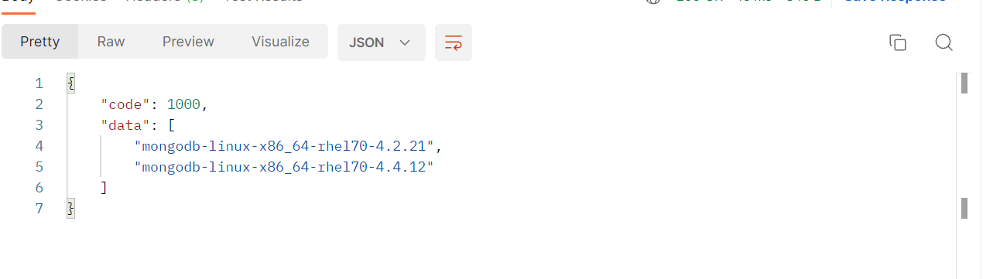
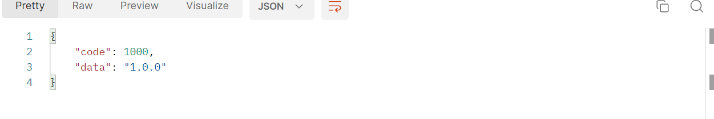

# Other API
To call this API, you need to set the `whaleal-Token` in the request header with the specified parameters. The returned content is in JSON format. Special entity classes for the response will be provided in the final table.

### Default Request Header Format, Special Cases are Specified

| KEY                |     VALUE      |     
| -------------------|----------------------|
| Accept-Encoding        |         gzip, deflate, br |     
| Connection          |         keep-alive           |          
| Content-Type          |         application/json |    

#### 1 Get All MongoDB Version Information

1.1 Request Path

GET: http://{Server-Host}:{Port}/api/server/other/getAllMongoVersion

---

1.2 Request

---

1.3 Response Result

|            | Description              | Schema   |
| ---------- | ------------------------ | -------- |
| code       | Status: 1000 for success, others for exceptions | int      |
| data       | Response data            | List     |

---

### 2 Get All Whaleal Version Information

2.1 Request Path

GET: http://{Server-Host}:{Port}/api/server/other/getWhalealVersion

---

2.2 Request

---

2.3 Response Result

|            | Description              | Schema   |
| ---------- | ------------------------ | -------- |
| code       | Status: 1000 for success, others for exceptions | int      |
| data       | Response message         | String   |

