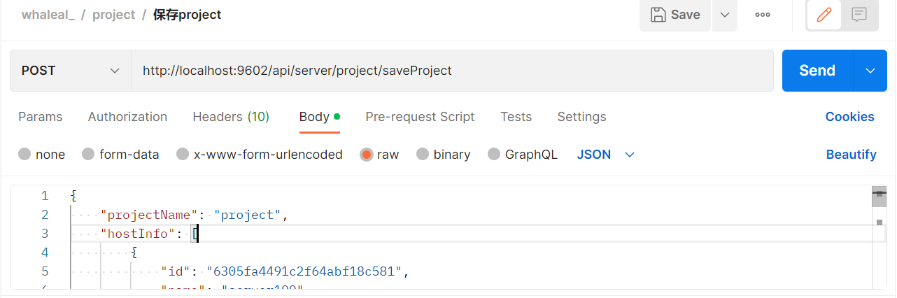
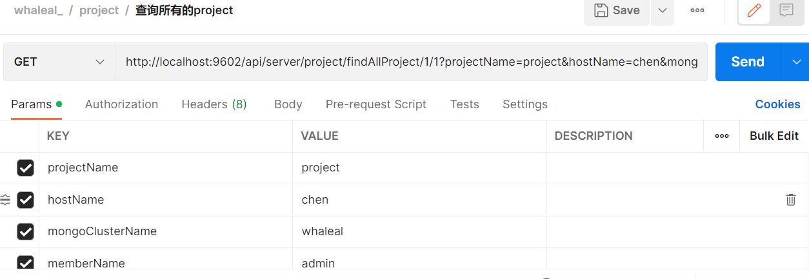
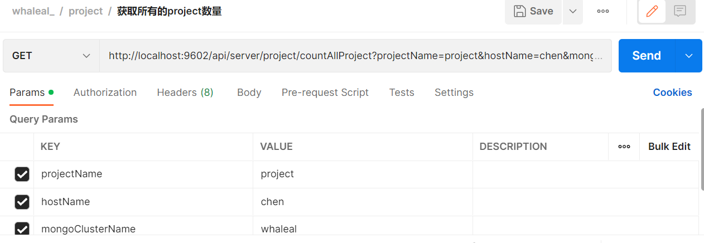
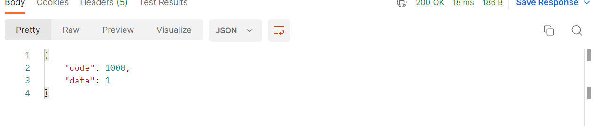

# Project API
To call this API, you need to set the `whaleal-Token` in the request header with the specified parameters. The returned content is in JSON format. Special entity classes for the response will be provided in the final table. Parameters related to time are passed in timestamp format.

### Default Request Header Format, Special Cases are Specified

    whaleal-Token is obtained when calling the login API and should be included in the request header for subsequent API calls.
[Login API to Obtain whaleal-Token](Member.md)

| KEY                |     VALUE      |     
| -------------------|----------------------|
| Accept-Encoding        |         gzip,deflate,br |     
| Connection          |         keep-alive           |          
| Content-Type          |         application/json |    
| whaleal-token          |         "token"           |     

### 1 Save Project

1.1 Request Path

POST: http://{Server-Host}:{Port}/api/server/project/saveProject

---

1.2 Request Parameters:

| Name                |     Located in     |           Description         |     Required    |        Schema   |
| -------------------|----------------------|-------------------------------|-----------------|-----------   |
| projectMongoEntity          |         Body           |            Project Entity            |        Yes       | ProjectMongoEntity        |


<br>

Example: Save a project. `projectMongoEntity` looks like this:
```json
{
    "projectName": "test",
    "hostInfo": [
        {
            "id": "6305fa4491c2f64abf18c581",
            "name": "server100"
        }
    ],
    "memberInfo": [
        {
            "id": "630321262ef5221f75e9f0c6",
            "name": "chen"
        }
    ],
    "mongoInfo": [
        {
            "id": "632ae4e496b892559b6a7aab",
            "name": "whaleal"
        }
    ],
    "dingDingList": [
        "qwe123"
    ]
}
```



----

1.3 Response Result

|            | Description              | Schema   |
| ---------- | ------------------------ | -------- |
| code       | Status: 1000 for success, others for exceptions | int      |
| data       | Response data            | ProjectMongoEntity     |

```json
{
    "msg": "Save success",
    "code": 1000,
    "data": {
        "id": "test",
        "createTime": 1664245657405,
        "updateTime": 1664245657405,
        "projectName": "test",
        "hostInfo": [
            {
                "id": "630eddeff3d9e72e3695ea48",
                "name": "chen"
            }
        ],
        "mongoInfo": [
            {
                "id": "632ae4e496b892559b6a7aab",
                "name": "whaleal"
            }
        ],
        "memberInfo": [
            {
                "id": "63031cb149d5ad2d50af5d15",
                "name": "admin"
            }
        ],
        "dingDingList": [
            "qwe123"
        ]
    }
}
```

### 2 Delete Project

2.1 Request Path

POST: http://{Server-Host}:{Port}/api/server/project/deleteProject/{{projectId}}

---

2.2 Request Parameters:

| Name                |     Located in     |           Description         |     Required    |        Schema   |
| -------------------|----------------------|-------------------------------|-----------------|-----------   |
| projectId          |         Path           |            Project ID            |        Yes       | String


----

2.3 Response Result

|            | Description              | Schema   |
| ---------- | ------------------------ | -------- |
| code       | Status: 1000 for success, others for exceptions | int      |
| msg        | Response message         | String   |


### 3 Get All Projects

3.1 Request Path

GET: http://{Server-Host}:{Port}/api/server/project/findAllProject/{{pageSize}}/{{pageIndex}}

---

3.2 Request Parameters:

| Name                |     Located in     |           Description         |     Required    |        Schema   |
| -------------------|----------------------|-------------------------------|-----------------|-----------   |
| pageSize          |         Path           |            Page size            |        Yes       | int
| pageIndex          |         Path           |            Page index            |        Yes       | int
| projectName          |         Params           |        Project name            |        No       | String
| hostName          |         Params           |        Host name            |        No       | String
| mongoClusterName          |         Params           |        MongoDB cluster name            |        No       | String
| memberName          |         Params           |        Member name            |        No       | String



----

3.3 Response Result

|            | Description              | Schema   |
| ---------- | ------------------------ | -------- |
| code       | Status: 1000 for success, others for exceptions | int      |
| data       | Response data            | List     |

```json
{
    "code": 1000,
    "data": [
        {
            "id": "project",
            "createTime": 1664245537831,
            "updateTime": 1664245537831,
            "projectName": "project",
            "hostInfo": [
                {
                    "id": "630eddeff3d9e72e3695ea48",
                    "name": "chen"
                }
            ],
            "mongoInfo": [
                {
                    "id": "632ae4e496b892559b6a7aab",
                    "name": "whaleal"
                }
            ],
            "memberInfo": [
                {
                    "id": "63031cb149d5ad2d50af5d15",
                    "name": "admin"
                }
            ],
            "dingDingList": [
                "qwe123"
            ]
        }
    ]
}
```

### 4 Get Total Number of Projects

4.1 Request Path

GET: http://{Server-Host}:{Port}/api/server/project/countAllProject

---

4.2 Request Parameters:

| Name                |     Located in     |           Description         |     Required    |        Schema   |
| -------------------|----------------------|-------------------------------|-----------------|-----------   |
| projectName          |         Params           |        Project name            |        No       | String
| hostName          |         Params           |        Host name            |        No       | String
| mongoClusterName          |         Params           |        MongoDB cluster name            |        No       | String
| memberName          |         Params           |        Member name            |        No       | String




----

4.3 Response Result

|            | Description              | Schema   |
| ---------- | ------------------------ | -------- |
| code       | Status: 1000 for success, others for exceptions | int      |
| data       | Response count           | int      |



### 5 Get Project by ID

5.1 Request Path

GET: http://{Server-Host}:{Port}/api/server/project/findProjectById/{{projectId}}

---

5.2 Request Parameters:

| Name                |     Located in     |           Description         |     Required    |        Schema   |
| -------------------|----------------------|-------------------------------|-----------------|-----------   |
| projectId          |         Path           |            Project ID            |        Yes       | String


----

5.3 Response Result

|            | Description              | Schema   |
| ---------- | ------------------------ | -------- |
| code       | Status: 1000 for success, others for exceptions | int      |
| data       | Response data            | ProjectMongoEntity     |

```json
{
    "code": 1000,
    "data": {
        "id": "qwe",
        "createTime": 1663899341009,
        "updateTime": 1663899341009,
        "projectName": "qwe",
        "hostInfo": [
            {
                "id": "630eddeff3d9e72e3695ea48",
                "name": "chen"
            },
            {
                "id": "6305fa4491c2f64abf18c581",
                "name": "server100"
            }
        ],
        "mongoInfo": [
            {
                "id": "632ae4e496b892559b6a7aab",
                "name": "whaleal"
            }
        ],
        "memberInfo": [
            {
                "id": "632138e2eef4de695d5116db",
                "name": "chen123"
            },
            {
                "id": "630321262ef5221f75e9f0c6",
                "name": "chen"
            }
        ],
        "dingDingList": []
    }
}
```

### 6 Update Project

6.1 Request Path

POST: http://{Server-Host}:{Port}/api/server/project/updateProject

---

6.2 Request Parameters:

| Name                |     Located in     |           Description         |     Required    |        Schema   |
| -------------------|----------------------|-------------------------------|-----------------|-----------   |
| projectMongoEntity          |         Body           |            Project Entity            |        Yes       | ProjectMongoEntity        |

Example: Update a project. `projectMongoEntity` looks like this:
```json
{
    "id": "qwe",
    "projectName": "qwe",
    "hostInfo": [
        {
            "id": "630eddeff3d9e72e3695ea48",
            "name": "chen"
        },
        {
            "id": "6305fa4491c2f64abf18c581",
            "name": "server100"
        }
    ],
    "mongoInfo": [
        {
            "id": "632ae4e496b892559b6a7aab",
            "name": "whaleal"
        }
    ],
    "memberInfo": [
        {
            "id": "632138e2eef4de695d5116db",
            "name": "chen123"
        },
        {
            "id": "630321262ef5221f75e9f0c6",
            "name": "chen"
        }
    ],
    "dingDingList": []
}
```

----

6.3 Response Result

|            | Description              | Schema   |
| ---------- | ------------------------ | -------- |
| code       | Status: 1000 for success, others for exceptions | int      |
| data       | Response data            | ProjectMongoEntity     |

```json
{
    "msg": "Update success",
    "code": 1000,
    "data": {
        "id": "qwe",
        "createTime": 1664248185424,
        "updateTime": 1664248185424,
        "projectName": "qwe",
        "hostInfo": [
            {
                "id": "630eddeff3d9e72e3695ea48",
                "name": "chen"
            },
            {
                "id": "6305fa4491c2f64abf18c581",
                "name": "server100"
            }
        ],
        "mongoInfo": [
            {
                "id": "632ae4e496b892559b6a7aab",
                "name": "whaleal"
            }
        ],
        "memberInfo": [
            {
                "id": "632138e2eef4de695d5116db",
                "name": "chen123"
            },
            {
                "id": "630321262ef5221f75e9f0c6",
                "name": "chen"
            }
        ],
        "dingDingList": []
    }
}
```

### 7 Get Members in Project

7.1 Request Path

GET: http://{Server-Host}:{Port}/api/server/project/getMemberInProject

---

7.2 Request


----

7.3 Response Result

|            | Description              | Schema   |
| ---------- | ------------------------ | -------- |
| code       | Status: 1000 for success, others for exceptions | int      |
| data       | Response data            | List     |


