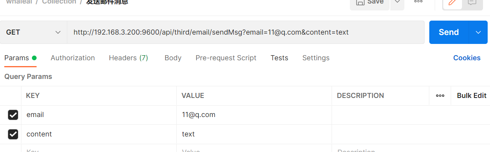
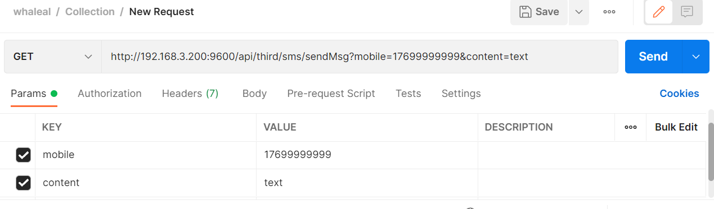

# Third-party API
To call this API, you need to set the `whaleal-Token` in the request header with the specified parameters. The returned content is in JSON format. Special entity classes for the response will be provided in the final table.

### Default Request Header Format, Special Cases are Specified

| KEY                |     VALUE      |     
| -------------------|----------------------|
| Accept-Encoding        |         gzip, deflate, br |     
| Connection          |         keep-alive           |          
| Content-Type          |         application/json |    

### 1 Send DingTalk Message

1.1 Request Path

GET: http://{Server-Host}:{Port}/api/third/ding/sendMsg

---

1.2 Request Parameters

| Name                |     Located in     |           Description         |     Required    |        Schema   |
| -------------------|----------------------|-------------------------------|-----------------|-----------   |
| accessToken        |         Params         |       DingTalk robot token      |      Yes            |    String
| secret             |         Params         |       DingTalk robot secret     |      Yes            |    String
| content            |         Params         |       Message content           |      Yes            |    String

----

1.3 Response Result

|            | Description              | Schema   |
| ---------- | ------------------------ | -------- |
| code       | Status: 1000 for success, others for exceptions | int      |
| data       | Response message         | String   |

---

### 2 Send Email Message

2.1 Request Path

GET: http://{Server-Host}:{Port}/api/third/email/sendMsg

---

2.2 Request Parameters

| Name                |     Located in     |           Description         |     Required    |        Schema   |
| -------------------|----------------------|-------------------------------|-----------------|-----------   |
| email              |         Params         |       Email account             |      Yes            |    String
| content            |         Params         |       Message content           |      Yes            |    String

----

2.3 Response Result

|            | Description              | Schema   |
| ---------- | ------------------------ | -------- |
| code       | Status: 1000 for success, others for exceptions | int      |
| data       | Response message         | String   |

---

### 3 Send SMS Verification Code

3.1 Request Path

GET: http://{Server-Host}:{Port}/api/third/sms/sendMsg

---

3.2 Request Parameters

| Name                |     Located in     |           Description         |     Required    |        Schema   |
| -------------------|----------------------|-------------------------------|-----------------|-----------   |
| mobile             |         Params         |       Phone number              |      Yes            |    String
| content            |         Params         |       Message content           |      Yes            |    String

----

3.3 Response Result

|            | Description              | Schema   |
| ---------- | ------------------------ | -------- |
| code       | Status: 1000 for success, others for exceptions | int      |
| data       | Response message         | String   |

