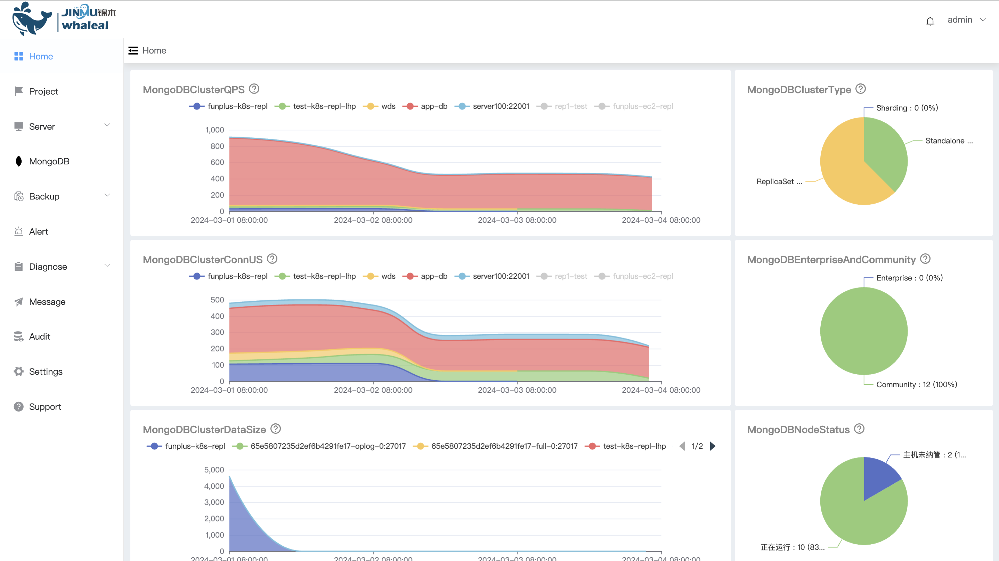

## Whaleal Platform Introduction

  Whaleal Platform (WAP) is an intelligent operation and maintenance hosting platform that monitors and manages your MongoDB service in real time 24/7. As an open source MongoDB database monitoring solution, WAP provides instant troubleshooting and diagnostic capabilities to ensure the continued stable operation of your MongoDB database and increase productivity. At the same time, WAP also supports automatic backup and recovery, providing you with comprehensive data protection to ensure data security and reliability. By choosing WAP, you will experience the convenience and efficiency of intelligent operation and maintenance.

## Whaleal Platform

## Architecture Introduction

The system architecture diagram depicts the overall structure of the system, which reflects the relationship between the various modules of the system.
Functional module division is to divide a complex system into multiple functional modules with single functions through layer-by-layer decomposition.
Based on the analysis and sorting of the system's functions, the specific functional modules of the data sharing and exchange system are summarized.

## WAP Feature

* **Flexible deployment**

  WAP supports highly customized MongoDB nodes according to business needs to achieve rapid and flexible deployment.

* **Global monitoring**

  The platform comprehensively monitors each MongoDB node, intelligently correlates Host monitoring, and provides intuitive troubleshooting methods.

* **Audit operation log**

  Recording detailed audit operation logs effectively supports historical review, helping to quickly troubleshoot and solve problems, and shortening troubleshooting time.

* **Automatic backup and recovery**

  WAP supports automatic backup and recovery functions, providing users with comprehensive data protection to ensure data security and reliability.

* **Communication encryption guarantee**

  WAP uses communication encryption technology to ensure the security of data transmission between MongoDB services and effectively prevent the leakage of sensitive information.

* **MongoDB real-time diagnostics**

  WAP supports real-time diagnosis, LogVis, Performance, ExplainPlan and other functions, providing comprehensive and accurate database performance monitoring.

* **Real-time alarm**

  WAP has a real-time alarm system that can quickly capture abnormalities in MongoDB nodes, such as performance degradation, insufficient storage, etc., and promptly notify administrators to ensure sensitive perception and rapid response to potential problems.
