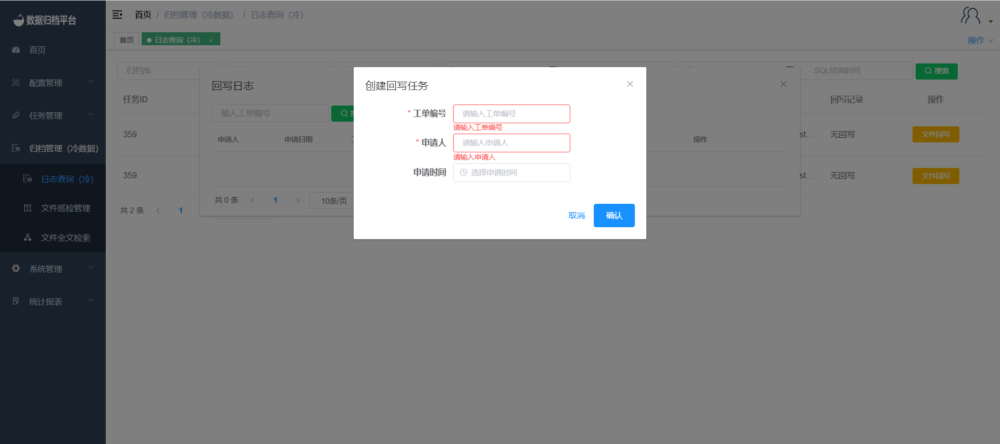

#### 		日志查询（冷）

​	点击归档管理菜单下的日志查询（冷），可查询出所有文件归档日志信息，此页面有搜索按钮及搜索的条件框和每个任务的回写按钮；

##### 				搜索

​	上方绿色按钮为搜索按钮，左侧条件框为搜索任务时的条件框，填写条件后点击搜索可过滤出所需的任务。

##### 				文件回写

​	点击任务后方黄色文件回写按钮，弹出页面点击创建会回写任务创建回写任务。

**创建回写任务**

​	点击创建回写任务按钮弹出以下表单，填写完成后点击确认即可。

**删除临时表**

​	创建回写任务完成后可任务开始回写，完成后点击删除临时表按钮弹出提示框，若确认删除点击执行即可，若不想删除点击取消。

