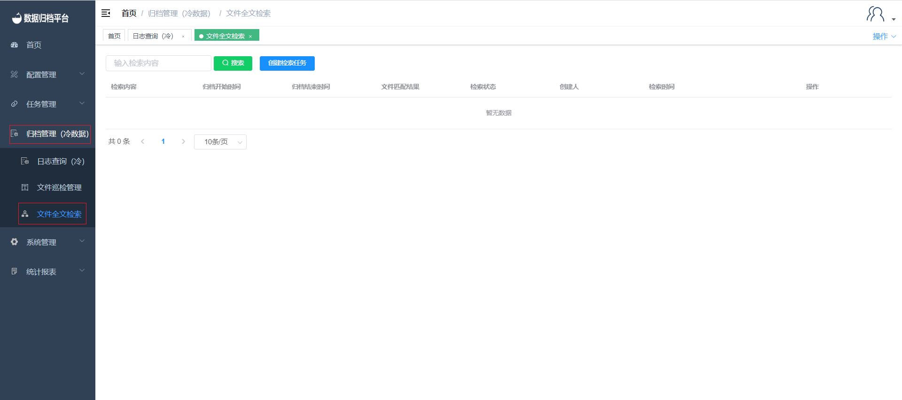

#### 		文件全文检索

​	点击归档管理菜单下的文件全文检索，可查询出所有文件全文检索日志信息，点击“创建检索任务”按钮后可创建文件全文检索任务，系统执行相应文件全局搜索，针对找到符合的文件记录，可以进行文件回写操作。

##### 				搜索

​	上方绿色按钮为搜索按钮，左侧条件框可选填，填写完条件后点击搜索按钮即可过滤出所需检索内容。

##### 				创建检索任务

​	点击蓝色按钮创建检索任务弹出以下表单，填写后点击确认。

