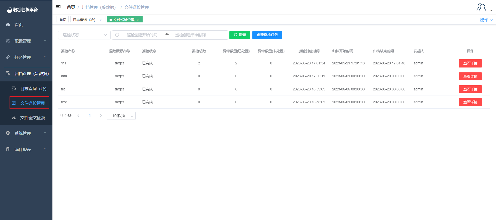

#### 		文件巡检管理

​	点击归档管理菜单下的文件巡检管理，可查询出所有文件巡检日志信息，点击“创建巡检任务”按钮后可创建文件巡检任务，系统执行相应文件检查校验逻辑，针对异常的文件记录，可以手工更新文件路径或执行重新归档操作。

##### 				搜索

​	上方绿色按钮为搜索按钮，左侧有条件框可进行选填，填写条件后点击搜索按钮即可过滤出所需的巡检。

##### 				创建巡检任务

​	点击蓝色按钮创建巡检任务弹出以下表格，填写后点击确认即可生成对应温数据目标源的巡检数据，完成后点击查看详情即可查看对应巡检内容如第二张图所示。

