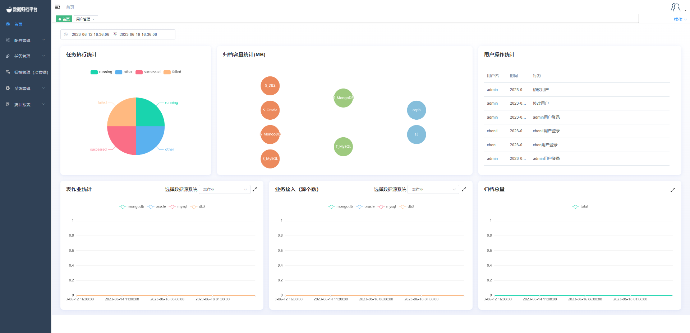

### 	首页展示

​	首页显示任务执行统计、归档容量统计、表作业统计、业务接入数、归档总容量及用户操作的滚动播放，上方时间处可自定义选择某时间段内的数据展示。

#### 		任务执行统计

​	任务执行统计饼状图显示了在某时间范围内任务执行结果的种类的占比图。其任务执行状态分别有running（正在执行）、successed（成功完成）、failed（执行失败）、other（其余类型）。

#### 		归档容量统计

​	归档容量统计展示了各数据源类型同步到目标源类型的总大小，第一列为数据源类型第二列为目标源类型，其数据源四种类型都可同步到目标端MongoDB，但数据源为MYSQL时只能同步到MYSQL类型的目标源。第三列为冷数据目标端文件与目标端S3，其只有数据源为MongoDB时才可以归档至ceph，只有源数据为MongoDB Gridfs数据时才可同步到目标S3处。

#### 		用户操作统计

​	用户操作统计滚动展示了某个用户在某时间做了什么事，一些登录操作及任务执行等都将在此进行展示。

#### 		表作业统计

​	表作业统计展示了此时间端内各类表作业数量的折线图，方便用户观察近期任务执行趋势。也可选择下拉框内的作业类型进行展示不同类型数据源的折线图。

#### 		业务接入（源个数）

​	业务接入（源个数）指当前平台在此时间段内数据源接入的数量，将次绘制成折线图方便观察近期数据源的增长趋势。同样可选择数据源类型。

#### 		归档总量

​	归档总容量绘制了当前时间段内本平台总体归档了多大的数据量，使用折线图方便用户观察近期归档总量的增长趋势。
