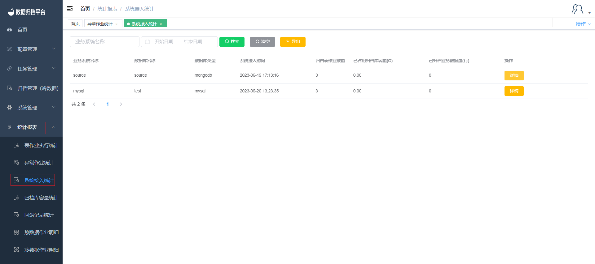

#### 		系统接入统计

​	点击统计报表菜单下的系统接入统计，可查询出所有接入本平台的业务，此页面有搜索按钮及搜索的条件框和清空条件框按钮与导出按钮；

##### 				搜索

​	上图绿色按钮为搜索按钮，左侧有两个条件框。填写完过滤条件后点击搜索即可过滤出符合条件的接入信息。

##### 				清空

​	黑色按钮为清空按钮，即情况条件框的时间。

##### 				导出

​	黄色按钮为导出按钮可将系统接入统计信息导出为xlsx文件。

##### 				详情

​	点击每条接入信息后面的详情，弹出此接入信息的详情。

	
