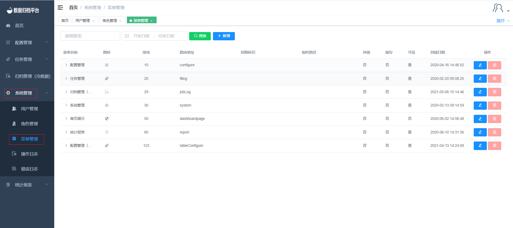
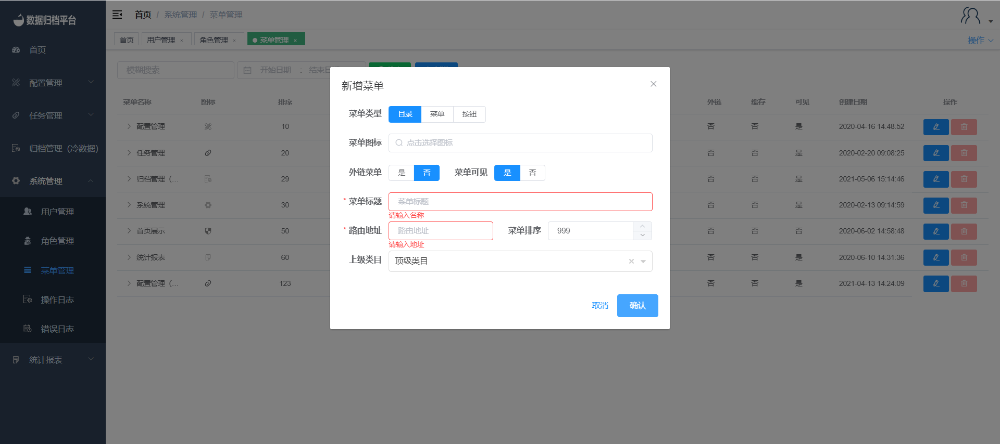
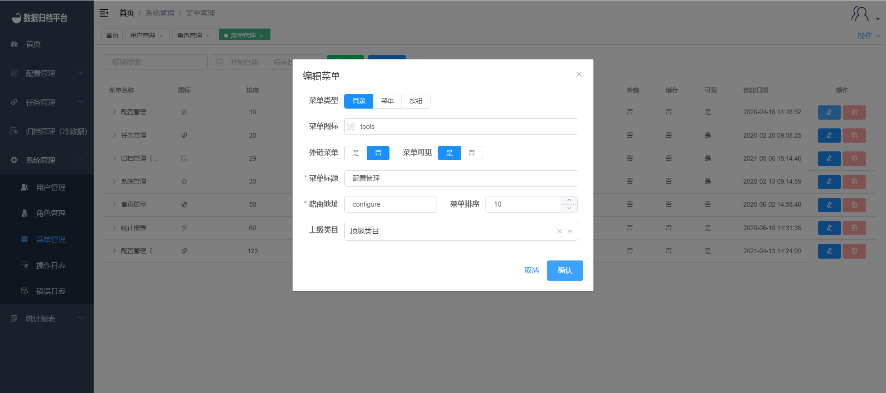

#### 		菜单管理

​	点击系统管理菜单下的菜单管理，此页面只有管理员用户可见，页面可以查看平台中所菜单的信息，可搜索、新增、修改、删除。

##### 				搜索

​	上方绿色按钮为搜索按钮，左侧两个条件框填写条件后点击搜索即可过滤出想要的菜单。

##### 				新增

​	蓝色按钮为新增按钮，弹出下图表单，可自定义菜单类型、菜单图标、外链菜单、菜单是否可见、菜单标题、路由地址、菜单排序、上级目录等。完成配置后点击确认即可保存。

##### 				修改

​	点击菜单名称右侧的蓝色铅笔按钮，弹出编辑表单可根据需求配置。完成后点击确认即可。

##### 				删除

​	菜单删除按钮不可用，以防误删可根据需求隐藏。
